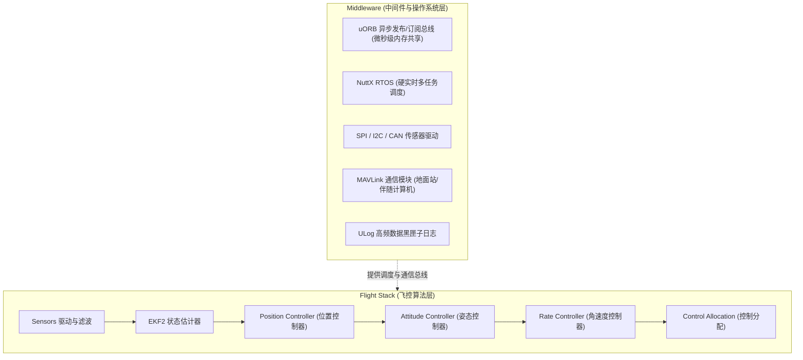
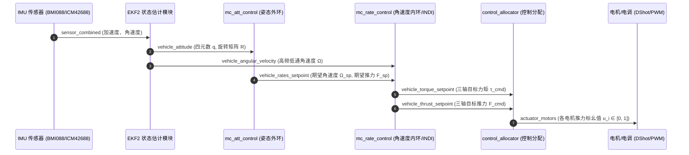
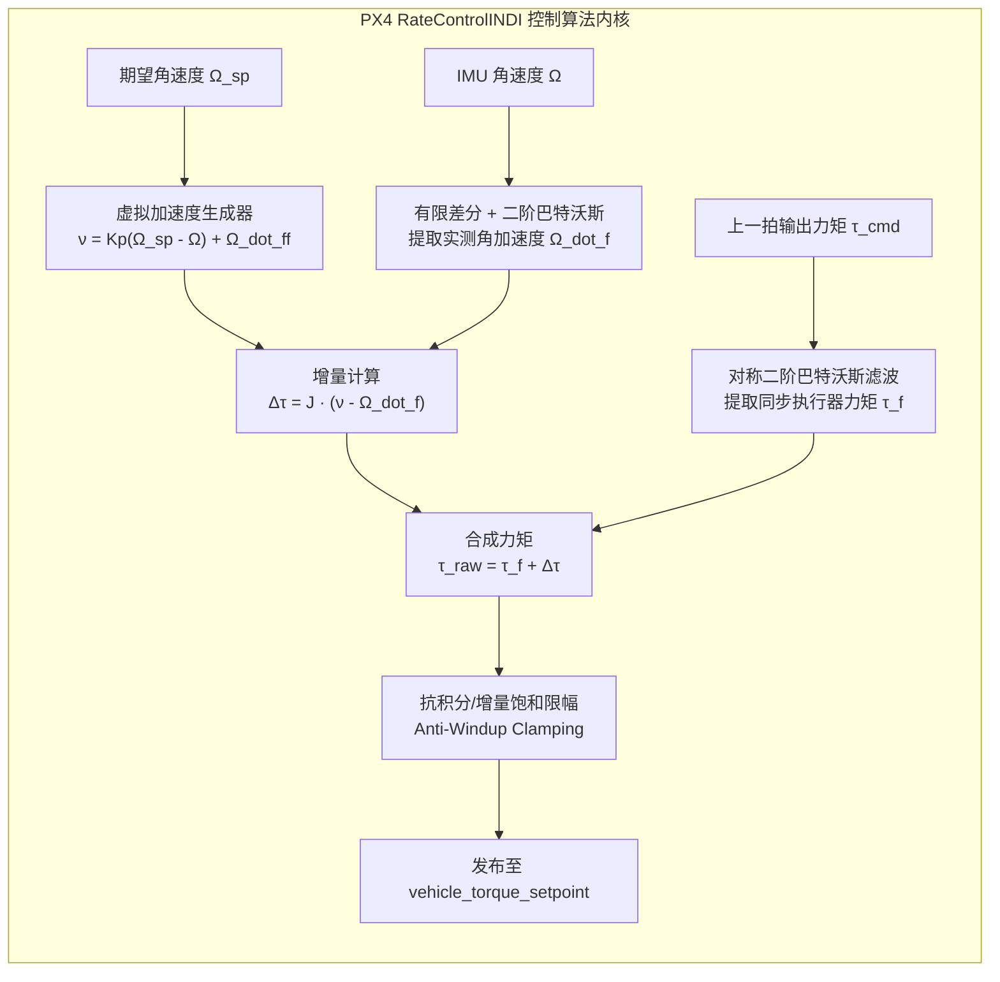

# PX4 飞控架构、控制体系与增量非线性动态逆（INDI）深度研报

---

## 目录
1. [PX4 整体架构设计哲学：Flight Stack 与 Middleware](#一-px4-整体架构设计哲学flight-stack-与-middleware)
2. [uORB 异步发布/订阅总线与实时控制链路](#二-uorb-异步发布订阅总线与实时控制链路)
3. [PX4 姿态与速率控制全链路数据流剖析](#三-px4-姿态与速率控制全链路数据流剖析)
4. [PX4 控制分配模块（Control Allocation）底层机制](#四-px4-控制分配模块control-allocation底层机制)
5. [原生 PID 速率控制器（MulticopterRateControl）源码解析与局限](#五-原生-pid-速率控制器multicopterratecontrol源码解析与局限)
6. [INDI 嵌入式控制架构设计与数学推导](#六-indi-嵌入式控制架构设计与数学推导)
7. [四大工程攻坚关键难点与落地对策](#七-四大工程攻坚关键难点与落地对策)
8. [面向水下 8 推进器（ROV/AUV）与空中四旋翼的差异化适配](#八-面向水下-8-推进器rovauv与空中四旋翼的差异化适配)

---

## 一、 PX4 整体架构设计哲学：Flight Stack 与 Middleware

PX4 不是单片机上简单的“大循环裸机程序”，而是一套高度模块化、面向工业级无人系统的开源自动驾驶仪操作系统。它在架构上严格划分为两层：

1. **Flight Stack（算法层）**：包含状态估计（EKF2）、导航规划（Navigator）、位置控制（Position Controller）、姿态控制（Attitude Controller）、角速度控制（Rate Controller）和控制分配（Control Allocator）。每个模块都是独立的 POSIX 任务（Task/Work Queue），彼此之间**严禁直接调用函数指针**，完全通过 uORB 消息总线解耦。
2. **Middleware（中间件层）**：运行在 NuttX 硬实时嵌入式操作系统上，提供微秒级任务调度、驱动抽象、uORB 进程间通信、MAVLink 协议解析和高频 ULog 日志记录。

---

## 二、 uORB 异步发布/订阅总线与实时控制链路

uORB（Micro Object Request Broker）是 PX4 的核心命脉。它是一种基于内存共享的超低延迟发布/订阅（Pub/Sub）机制：
* **单写入者/多读取者**：一个主题由一个主模块高频写入（如 IMU 驱动写入 `sensor_combined`），多个模块并行订阅；
* **非阻塞轮询（Polling）机制**：控制器任务（如 `mc_rate_control`）通常阻塞在 `uORB::SubscriptionCallbackWorkItem` 上，等待最新的陀螺仪数据更新（如 1kHz/800Hz）。一旦新数据到达，RTOS 立即唤醒控制器执行一次计算，计算完成后发布力矩指令并迅速让出 CPU。

---

## 三、 PX4 姿态与速率控制全链路数据流剖析

从传感器采集原始物理量到电机产生推力，PX4 的核心闭环数据流向如下表与流程图所示：

### 关键 uORB 消息结构字段说明：
1. **`vehicle_angular_velocity.msg`**：
   * `xyz[3]`：机体坐标系（FRD: 前-右-下）下的三轴角速度 $[p, q, r]\ (\text{rad/s})$；
   * `xyz_derivative[3]`：部分 IMU 驱动直接输出的有限差分角加速度（若未启用则需在控制器中自行滤波提取）。
2. **`vehicle_rates_setpoint.msg`**：
   * `roll, pitch, yaw`：外环姿态控制器计算出的期望三轴角速度 $\boldsymbol{\Omega}_{sp}\ (\text{rad/s})$；
   * `thrust_body[3]`：期望机体推力矢量。
3. **`vehicle_torque_setpoint.msg`**：
   * `xyz[3]`：内环控制器计算出的三轴期望广义控制力矩 $\boldsymbol{\tau} = [\tau_x, \tau_y, \tau_z]\ (\text{Nm})$。

---

## 四、 PX4 控制分配模块（Control Allocation）底层机制

在 PX4 v1.14+ 中，力矩计算与电机混控彻底解耦，由通用的 `control_allocator` 模块统一处理：

### 1. 效能矩阵（Effectiveness Matrix）数学映射
对于具有 $m$ 个执行器（四旋翼 $m=4$，水下 8 推 ROV $m=8$）的系统，设执行器输出为 $\boldsymbol{u} = [u_1, u_2, \dots, u_m]^T \in [0, 1]^m$，机体六维广义力和力矩为 $\boldsymbol{\nu} = [\boldsymbol{\tau}^T, \boldsymbol{F}^T]^T \in \mathbb{R}^6$。两者之间的映射关系为：

$$\boldsymbol{\nu} = \boldsymbol{B} \boldsymbol{u}$$

其中 $\boldsymbol{B} \in \mathbb{R}^{6 \times m}$ 为控制效能矩阵。对于第 $i$ 个推进器，其安装位置矢量为 $\boldsymbol{r}_i = [x_i, y_i, z_i]^T$，推力方向单位矢量为 $\boldsymbol{d}_i = [d_{x,i}, d_{y,i}, d_{z,i}]^T$，推力系数为 $c_{T,i}$，反扭矩系数为 $c_{M,i}$，则该推进器在矩阵 $\boldsymbol{B}$ 中对应的列向量为：

$$\boldsymbol{B}_{:, i} = \begin{bmatrix} \boldsymbol{r}_i \times \boldsymbol{d}_i \cdot c_{T,i} + \boldsymbol{d}_i \cdot c_{M,i} \\ \boldsymbol{d}_i \cdot c_{T,i} \end{bmatrix}$$

### 2. 分配求解算法
PX4 内置了多种求解器（通过参数 `CA_METHOD` 配置）：
* **伪逆分配（Pseudo-Inverse）**：$\boldsymbol{u} = \boldsymbol{B}^T (\boldsymbol{B} \boldsymbol{B}^T)^{-1} \boldsymbol{\nu}$，速度极快，适合无饱和情况；
* **序贯饱和裁剪（Sequential Desaturation）**：当某个电机输出超出 $[0, 1]$ 时，优先削减总推力以保证姿态控制力矩，防止失控翻滚；
* **二次规划（Quadratic Programming, QP）**：显式处理推力下限 $u_{\min}$ 与上限 $u_{\max}$，求解带约束的最优分配。

---

## 五、 原生 PID 速率控制器（MulticopterRateControl）源码解析与局限

### 1. 原生 PID 算法逻辑
在 `src/modules/mc_rate_control/MulticopterRateControl.cpp` 中，三轴力矩指令计算如下：

$$\boldsymbol{\tau}_{PID} = \boldsymbol{K}_p (\boldsymbol{\Omega}_{sp} - \boldsymbol{\Omega}) + \boldsymbol{K}_i \int (\boldsymbol{\Omega}_{sp} - \boldsymbol{\Omega}) dt + \boldsymbol{K}_d \frac{d(\boldsymbol{\Omega}_{sp} - \boldsymbol{\Omega})}{dt} + \boldsymbol{\tau}_{FF}$$

### 2. 传统 PID 在极限机动与水下环境中的固有缺陷
1. **积分项（I项）滞后严重**：当无人机遭遇突发侧风或水下机器人处于强非线性流场阻尼中时，积分项需要经历数百毫秒的误差累积才能逐渐爬升推力，导致明显的稳态误差与超调；
2. **微分项（D项）对噪声极敏感**：D项直接对误差微分，容易放大陀螺仪高频噪声，导致电机发热；
3. **全飞行包线无法泛化**：当电池电压从 4.2V 下降到 3.5V，或挂载重量变化时，固定增益的 PID 性能急剧劣化。

---

## 六、 INDI 嵌入式控制架构设计与数学推导

增量非线性动态逆（INDI）彻底改变了控制范式：**将受控对象的复杂非线性动力学模型，完全用高频传感器测量值进行等效替换**。

### 1. 严格数学推导
系统刚体旋转动力学方程为：
$$\boldsymbol{J} \dot{\boldsymbol{\Omega}} + \boldsymbol{\Omega} \times (\boldsymbol{J} \boldsymbol{\Omega}) = \boldsymbol{\tau} + \boldsymbol{\tau}_{\text{ext}}(\boldsymbol{\Omega}, \boldsymbol{v})$$

其中 $\boldsymbol{\tau}_{\text{ext}}$ 包含所有未知的气动阻尼力矩、水动力阻尼力矩与外部扰动。
定义综合扰动项为 $\boldsymbol{f}(\boldsymbol{\Omega}) = \boldsymbol{\tau}_{\text{ext}} - \boldsymbol{\Omega} \times (\boldsymbol{J} \boldsymbol{\Omega})$，则动力学简化为：
$$\boldsymbol{J} \dot{\boldsymbol{\Omega}} = \boldsymbol{\tau} + \boldsymbol{f}(\boldsymbol{\Omega})$$

在控制周期 $k$ 处进行一阶泰勒展开（采样周期 $\Delta t = 0.002\text{ s}$ 极短，$\boldsymbol{f}(\boldsymbol{\Omega})$ 在相邻节拍变化量远小于力矩变化量）：
$$\boldsymbol{J} \dot{\boldsymbol{\Omega}}(k) \approx \boldsymbol{J} \dot{\boldsymbol{\Omega}}(k-1) + (\boldsymbol{\tau}(k) - \boldsymbol{\tau}(k-1))$$

引入期望虚拟角加速度 $\boldsymbol{\nu}(k) = \dot{\boldsymbol{\Omega}}_{sp} + \boldsymbol{K}_p (\boldsymbol{\Omega}_{sp} - \boldsymbol{\Omega})$，代入 $\dot{\boldsymbol{\Omega}}(k)$，并用经过低通滤波的传感器角加速度 $\dot{\boldsymbol{\Omega}}_f$ 和对称滤波的力矩反馈 $\boldsymbol{\tau}_f$ 替换上一拍状态，解得 **INDI 控制律**：

$$\Delta \boldsymbol{\tau}(k) = \boldsymbol{J} (\boldsymbol{\nu}(k) - \dot{\boldsymbol{\Omega}}_f(k))$$
$$\boldsymbol{\tau}(k) = \boldsymbol{\tau}_f(k) + \Delta \boldsymbol{\tau}(k)$$

> 💡 **核心数学结论**：未知的非线性阻尼项 $\boldsymbol{f}(\boldsymbol{\Omega})$ 在公式中被完全消除！系统仅需知道主惯量矩阵 $\boldsymbol{J} = \text{diag}(J_{xx}, J_{yy}, J_{zz})$ 即可实现无模型解耦控制。

---

## 七、 四大工程攻坚关键难点与落地对策

### 难点 1：低成本 MEMS 陀螺仪微分噪声滤除
* **理论推导**：采用双线性变换法（Bilinear Transform / Tustin's Method）将连续域二阶巴特沃斯低通滤波器离散化：
  $$H(s) = \frac{\omega_c^2}{s^2 + \sqrt{2}\omega_c s + \omega_c^2} \quad \xrightarrow{s = \frac{2}{T_s}\frac{1 - z^{-1}}{1 + z^{-1}}} \quad H(z) = \frac{b_0 + b_1 z^{-1} + b_2 z^{-2}}{1 + a_1 z^{-1} + a_2 z^{-2}}$$
* **滤波差分算法**：
  $$\dot{\boldsymbol{\Omega}}_{\text{raw}}(k) = \frac{\boldsymbol{\Omega}(k) - \boldsymbol{\Omega}(k-1)}{T_s}$$
  $$\dot{\boldsymbol{\Omega}}_f(k) = b_0 \dot{\boldsymbol{\Omega}}_{\text{raw}}(k) + b_1 \dot{\boldsymbol{\Omega}}_{\text{raw}}(k-1) + b_2 \dot{\boldsymbol{\Omega}}_{\text{raw}}(k-2) - a_1 \dot{\boldsymbol{\Omega}}_f(k-1) - a_2 \dot{\boldsymbol{\Omega}}_f(k-2)$$
* **参数建议**：四旋翼无人机截止频率建议设为 $\omega_c = 30 \sim 40\text{ Hz}$；水下 ROV/AUV 建议设为 $\omega_c = 10 \sim 20\text{ Hz}$。

---

### 难点 2：传感器延迟与执行器响应的时间对齐（消除抖振的灵魂）
* **物理机制**：陀螺仪低通滤波产生了时延 $\tau_{\text{delay}} \approx \frac{\sqrt{2}}{\omega_c}$。如果不做任何处理，$\dot{\boldsymbol{\Omega}}_f(k)$ 实际对应的是数拍之前的电机输出，控制器会误认为“当前推力未起效”而持续反向猛加推力，导致系统在 $10 \sim 15\text{ Hz}$ 发生大幅度极限环剧烈抖振。
* **对策**：为控制输出 $\boldsymbol{\tau}$ 建立一个完全相同的二阶巴特沃斯数字滤波通道：
  $$\boldsymbol{\tau}_f(k) = H(z) \cdot \boldsymbol{\tau}(k-1)$$
  使“传感器观测量”与“执行器指令量”在频域相位上达到严格对齐。

---

### 难点 3：执行器饱和时的增量抗积分饱和（Anti-Windup）
* **物理机制**：当电机已达 $100\%$ 满偏或 $0\%$ 停转时，若系统依然存在姿态误差，$\Delta \boldsymbol{\tau}$ 会继续累加，导致内部计算力矩无限发散。
* **对策**：
  1. 设定物理力矩软限幅区间 $[\boldsymbol{\tau}_{\min}, \boldsymbol{\tau}_{\max}]$；
  2. 当输出力矩触顶且 $\Delta \boldsymbol{\tau}$ 仍同向增大时，**强制将增量清零**：
     $$\Delta \boldsymbol{\tau} = \text{clamp}(\Delta \boldsymbol{\tau}, -\Delta \boldsymbol{\tau}_{\max}, \Delta \boldsymbol{\tau}_{\max})$$
     $$\boldsymbol{\tau}_{\text{cmd}} = \text{constrain}(\boldsymbol{\tau}_f + \Delta \boldsymbol{\tau}, \boldsymbol{\tau}_{\min}, \boldsymbol{\tau}_{\max})$$

---

### 难点 4：PX4 参数系统注册与动态热切换机制
在 PX4 中注册如下自定义参数：
* `INDI_ENABLE`：0（关闭，使用原生 PID），1（启用 INDI 控制器）；
* `INDI_RATE_P_X / Y / Z`：三轴虚拟加速度比例增益（推荐初值：滚转/俯仰 $8.0 \sim 12.0$，偏航 $3.0 \sim 5.0$）；
* `INDI_FILT_CUTOFF`：二阶低通滤波截止频率（单位：Hz，推荐初值：$35.0\text{ Hz}$）；
* `INDI_INERTIA_X / Y / Z`：机体主转动惯量（单位：$\text{kg}\cdot\text{m}^2$）。

---

## 八、 面向水下 8 推进器（ROV/AUV）与空中四旋翼的差异化适配

| 差异维度 | 空中四旋翼无人机 (Multirotor) | 水下 8 推进器潜水器 (BlueROV2 Heavy / AUV) |
| :--- | :--- | :--- |
| **控制自由度** | 欠驱动系统（4 控制输入控制 6 自由度，滚转/俯仰与水平位移强耦合） | **全驱动 6-DOF 系统**（8 个空间矢量推进器独立控制 6 个自由度） |
| **动力学惯性特征** | 仅刚体惯性矩阵 $\boldsymbol{J}_{RB}$ | **刚体惯性 + 水动力附加质量惯性** $\boldsymbol{J} = \boldsymbol{J}_{RB} + \boldsymbol{J}_A$ |
| **控制分配矩阵** | $4 \times 4$ 混控矩阵（垂直推力 + 三轴力矩） | **$6 \times 8$ 空间几何配置矩阵**（三维力 + 三轴力矩全部映射） |
| **水动力/气动阻尼** | 高速时显现（速度平方阻尼），低速可忽略 | **全速段极其显著**（低速线性阻尼 + 高速二次阻尼），流场极复杂 |
| **INDI 的收益体现** | 极限 20m/s 竞速拐弯、抗阵风、载荷突变 | **彻底消除水动力阻尼建模不准导致的定点悬停严重漂移** |
