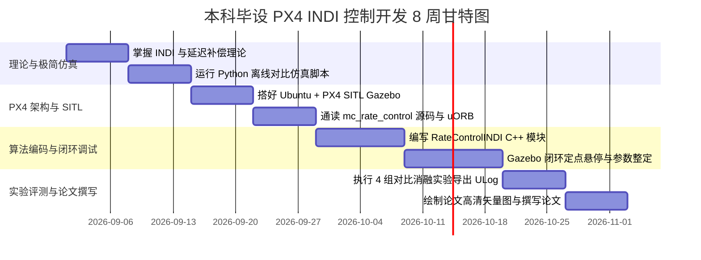

# 零基础 8 周高效推进路线图与踩坑排查手册

---

## 📅 8 周详细工作分解结构 (WBS)

---

## 🛠️ 常见报错与排坑排查手册（Troubleshooting）

### 1. 现象：启动后无人机剧烈抖动（高频发抖，振荡频率约 10~20Hz）
* **根本原因**：传感器角加速度滤波延迟与执行器指令未对齐，或者滤波截止频率 `INDI_FILT_CUTOFF` 设得过低（导致相位严重滞后）。
* **排查方案**：
  1. 检查 `_actuator_filter` 是否与 `_ang_accel_filter` 共享完全相同的截止频率参数；
  2. 将 `INDI_FILT_CUTOFF` 从 $20\text{ Hz}$ 适当调高至 $35 \sim 45\text{ Hz}$；
  3. 适当减小 P 增益 `INDI_RATE_P_X/Y`。

### 2. 现象：电机输出持续打满饱和，无法收敛
* **根本原因**：惯量参数 `INDI_INERTIA_X/Y/Z` 设得过大（高估了物理惯量），导致 $\Delta \tau$ 增量力矩单步计算过大。
* **排查方案**：
  1. 将惯量参数缩小 2~3 倍，观察是否恢复稳定；
  2. 启用增量力矩限幅 `_param_indi_max_torque`。

### 3. 现象：偏航轴（Yaw）响应发飘或转向无力
* **根本原因**：四旋翼偏航轴反扭矩较小，控制效能远低于滚转/俯仰轴。
* **排查方案**：
  1. 偏航轴 P 增益 `INDI_RATE_P_Z` 通常取滚转轴的 $1/3 \sim 1/2$；
  2. 适当放宽偏航轴的抗饱和限幅阈值。
