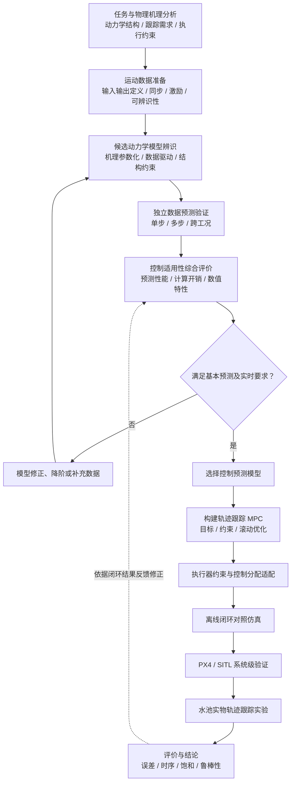

# SwiftROV 毕业论文开题报告研究主线全局重构方案

> **文档性质**：开题报告学术定位、立项逻辑、研究内容、技术路线与章节写作的全局重构建议  
> **研究领域**：水下机器人（AUV/ROV）动力学建模、系统辨识与轨迹跟踪预测控制  
> **研究对象**：紧凑集成、便携式、八推进器 SwiftROV 水下航行器  
> **适用范围**：毕业论文开题报告（Thesis Proposal），不等同于中期检查报告、工程开发计划或实验结果总结  
> **文档状态**：建议稿；具体选题名称、模型路线和实验条件以导师审议与后续核验为准

---

## 0. 总体评审意见与重构原则

### 0.1 核心评审结论

建议将课题从单一平台控制功能开发，重新定位为：

> **面向紧凑型多推进器水下航行器的控制导向动力学辨识与轨迹跟踪预测控制研究。**

该定位以可推广的水下运动控制问题作为立项依据，以 SwiftROV 作为研究对象与物理验证载体。课题不以代码规模、硬件接线、通信协议、已有人员进展或系统集成工作量来证明研究价值。

### 0.2 统一核心研究问题

> 面对紧凑型多推进器水下航行器的非线性水动力、模型不确定性和执行器物理约束，如何构建兼顾动态预测能力与在线计算可行性的控制模型，并据此实现和评价轨迹跟踪预测控制？

由此形成三个递进研究问题：

- **RQ1｜模型从哪里来？** 如何结合水动力机理与运行数据建立适合轨迹预测的动力学模型？
- **RQ2｜为什么选这个模型？** 如何在预测精度、跨工况泛化、模型复杂度与在线求解代价之间作合理权衡？
- **RQ3｜模型能否真正改善控制？** 如何将辨识模型用于约束 MPC，并通过独立验证与闭环实验评价其控制适用性？

**最重要的学术中轴是 RQ2。** 若仅完成“建模—套用 MPC”，研究容易成为两个成熟方法的简单组合。模型的**控制适用性评价与选取依据**应被明确设计为连接辨识与控制的关键研究环节。

### 0.3 三份仓库文件的作用与适用优先级

| 文件 | 应承担的作用 | 本次重构处理原则 |
| --- | --- | --- |
| 根目录 `AGENTS.md` | 全局规则、事实约束、学术红线 | 严格遵守；特别是样机构型、问题驱动、方法开放与历史文件保护 |
| `开题报告/SwiftROV_开题前信息与研究路线梳理.md` | 当前讨论形成的研究路线、已知条件、待核验问题 | 作为新的研究内容收敛依据；不得将讨论设想写成已完成结果 |
| `docs/contracts/opening_report_contracts_and_evidence.md` | 章节论证职责、证据规范及历史研究组织方式 | 保留章节功能与证据要求，修订与最新主线冲突的技术任务 |

当较早章节契约与较新研究台账在技术重点上不一致时，应遵循全局规则，在导师确认的前提下**修订旧契约**，而非为兼容历史表述而人为扩大课题范围。

特别需要调整的是：将原本并列的“建模辨识—控制设计—推进器分配”，重新组织为“**动力学辨识—模型适用性评价—预测控制与验证**”；推进器分配作为保证广义力可实现性的控制执行环节，暂不预设为独立算法创新课题。

### 0.4 不可突破的学术边界

1. **构型事实准确**：SwiftROV 描述为紧凑集成的便携式水下航行器；八台推进器的空间布置及控制能力需要依据实物构型论证。
2. **立项理由独立于平台存量**：平台提供数据、验证和约束条件，不构成研究动机本身。
3. **开题阶段不承诺尚未产生的结果**：不得虚构模型精度、控制误差、性能提升比例、实时频率、参数值或实验完成情况。
4. **方法只确立候选与比较准则**：不预先指定最终神经网络形式、MPC 类型、预测时域、权重或求解器。
5. **论文应有可检验的研究假设**：创新点是拟探索的贡献，不能将现成工具集成包装成已经证明的理论创新。
6. **真实执行约束不可缺位**：八推进器不自动意味着任意六维广义力都可以独立、无约束地实现。

---

## 一、课题立项逻辑与物理矛盾的学术重构（Why）

### 1.1 研究对象与任务表述

研究对象为**紧凑型、便携式、八推进器水下航行器**，以 SwiftROV 为物理载体。研究任务聚焦于给定参考运动任务下的**轨迹跟踪**，包括必要的状态估计、动力学预测、输入约束和闭环性能评价。

在开题中，应按以下关系建立论证：

**水下运动作业需求 → 轨迹跟踪性能要求 → 动力学与执行约束带来的瓶颈 → 控制导向辨识及预测控制需求 → 可验证的研究问题。**

不得将“平台已有”“某套飞控软件已选定”或“底层功能需要开发”作为这一因果链条的起点。

### 1.2 主要矛盾：复杂水动力响应与高精度轨迹跟踪需求

水下航行器的运动响应受以下因素影响：

- 附加质量及惯性耦合；
- 非线性速度阻尼；
- 重力、浮力与恢复力矩；
- 推进器作用、模型参数不确定性及外部扰动；
- 多轴耦合运动中的未建模动态。

这些因素使“期望控制作用—实际运动响应”之间难以始终保持准确对应。即使控制器具有高质量的参考轨迹，动力学预测失配仍可能降低跟踪质量。

**建议的研究问题表述：**

> 如何在有限实验数据与物理先验条件下，建立能够有效描述紧凑型水下航行器主要运动响应、并服务于轨迹跟踪预测控制的动力学模型？

说明：不宜引用未经具体构型与试验支持的固定附加质量比例，也不宜断言某种干扰必然导致特定失稳结果。

### 1.3 支撑矛盾一：预测能力与在线优化成本

复杂模型可能增强非线性表达能力，却可能带来更大的积分、线性化、求导和滚动优化计算负担。模型在离线数据上的拟合表现，并不等价于其在 MPC 中的实时控制价值。

因此：

> **模型越复杂，不必然意味着闭环控制越好；模型越简单，也不必然意味着在目标任务下预测能力足够。**

本课题最适合将**预测能力—计算代价—闭环效果**之间的关系确立为主要研究切入点。

必须区分：

1. 单步辨识误差；
2. 多步滚动预测误差；
3. 模型嵌入 MPC 后的优化求解时间与时序可靠性；
4. 闭环跟踪误差及执行约束遵守情况。

### 1.4 支撑矛盾二：期望广义力与实际执行能力

对多推进器航行器，可采用一般广义力映射关系：

\[
\boldsymbol{\tau}=B\boldsymbol f
\]

其中：

- \(\boldsymbol{\tau}\)：机体系期望广义力/力矩；
- \(B\)：由推进器安装位置与推力方向决定的配置矩阵；
- \(\boldsymbol f\)：各推进器产生的推力。

需强调：

- 推进器数量多于控制维数不等于自动具备全部方向的独立控制能力；
- 需分析配置矩阵秩、条件数与实际可达的广义力集合；
- 推进器推力幅值、变化速率及方向限制可能使优化器给出的期望控制作用不可实现。

这些约束应进入控制问题的建模与评估，但**不必预先将新的控制分配算法作为独立研究任务**。

### 1.5 从矛盾到立项的完整推导

| 立项层级 | 应回答的问题 | 本课题的对应表述 |
| --- | --- | --- |
| 应用需求 | 为什么需要更可靠的轨迹跟踪？ | 水下巡检、观测与精细运动作业需要稳定、可重复的运动控制 |
| 物理瓶颈 | 为什么控制难？ | 非线性水动力、模型失配、多轴耦合与执行限制 |
| 方法瓶颈 | 为什么不能仅追求高拟合精度？ | 高精度模型可能增加在线优化代价，且不保证闭环收益 |
| 研究切入 | 具体研究什么？ | 控制导向建模、模型适用性比较、约束 MPC |
| 验证路径 | 如何形成证据？ | 独立数据验证、统一条件下的控制比较、SITL 与水池实验 |

### 1.6 理论意义与工程应用价值

**理论意义建议表述：**

围绕复杂水动力系统的控制导向建模问题，研究机理模型与数据驱动方法的动态预测适用性，分析多步预测能力、计算复杂度与闭环轨迹跟踪表现之间的关系，为水下航行器的预测模型选择与约束控制设计提供实验依据。

**工程应用价值建议表述：**

面向紧凑型便携式水下航行器的运动控制需求，研究在有限计算资源、状态测量条件及推进器能力约束下具有实际可实现性的轨迹跟踪方案，为水池或近场作业环境中的运动控制性能评估与方法选型提供参考。

**写作禁区：**

- 不用“已为现有实验平台开发多少功能”证明研究意义；
- 不预设尚未确认的近壁面强流、深海或高强度流扰场景；
- 不用“传统 PID 不先进”替代文献论证；
- 不宣称“首次将辨识与 MPC 结合”；
- 不将仿真成功直接等同于实物控制有效。

---

## 二、核心研究内容收敛与模块重组（What）

### 2.1 新的三层研究主线

建议保留**三个核心研究内容**：

1. **面向控制的动力学建模与系统辨识**：解决预测模型的来源与有效性。
2. **面向在线求解的预测模型适用性评价与比选**：解决模型为什么值得用于控制。
3. **基于辨识模型的轨迹跟踪 MPC 设计与系统级验证**：解决所选模型能否支撑可实现的闭环控制。

三者构成：

**研究内容一（建模） → 研究内容二（评价/选模） → 研究内容三（控制/验证）**

其中第三项的实验结果可反过来帮助修正辨识目标或模型选择。

### 2.2 研究内容一：面向轨迹跟踪的动力学建模与系统辨识

**研究目标**

结合航行器运动机理和可获取数据，建立能够描述主要动态响应、具有明确适用范围且可以用于多步轨迹预测的动力学模型。

**主要研究工作**

1. 依据水下航行器运动学与动力学理论，建立统一状态与输入描述；
2. 分析附加质量、阻尼、重浮力及推进器作用中需要辨识或简化的部分；
3. 检查数据输入输出的物理含义、同步性、激励覆盖与可辨识性；
4. 构建机理参数化模型及有研究价值的候选替代模型；
5. 在独立数据上评价状态预测能力与模型适用范围。

**候选模型族及其比较位置**

| 候选方向 | 价值 | 需要验证的限制 |
| --- | --- | --- |
| Fossen 框架下的机理参数化模型 | 结构可解释、便于约束与控制设计 | 参数可辨识性、简化模型误差 |
| Neural ODE 等数据驱动连续动力学模型 | 有潜力描述复杂非线性响应 | 数据覆盖、积分开销、泛化与可解释性 |
| Port-Hamiltonian 等结构约束模型 | 利用能量、耗散等结构先验 | 物理结构适配性、训练成本与在线求解开销 |
| 适当的简化或混合模型 | 可能取得可用精度与计算量的折中 | 模型简化边界、残差的工况依赖 |

以上是**候选模型类别而非全部必须完成的任务**。Neural ODE 与结构约束思想并不必然互斥。建议以一种可信、可解释的参数化模型作为基线，再根据数据与研究时间选取一个重点候选进行深入比较。

**阶段产出**

- 具有物理定义的模型输入、状态与输出；
- 候选动力学预测模型；
- 独立数据验证结果；
- 已知失配因素与模型适用范围说明。

### 2.3 研究内容二：面向在线预测控制的模型适用性评价与比选

**研究目标**

不再以离线拟合误差作为唯一选模依据，而是建立针对轨迹跟踪预测控制的**多维模型评价框架**。

**拟比较的维度**

| 评价维度 | 典型观测量 | 研究目的 |
| --- | --- | --- |
| 单步预测 | 状态一步预测误差 | 检查局部动态拟合能力 |
| 多步预测 | 滚动预测误差及其随预测时间变化 | 检查预测模型用于优化的稳定性 |
| 跨工况泛化 | 不同运动组合、速度区间或轨迹的误差 | 检查训练分布依赖 |
| 数值与计算代价 | 预测、积分、求导或局部线性化耗时 | 判断模型计算负担 |
| 控制集成适用性 | 约束表达、优化收敛、求解时序 | 判断 MPC 可实现性 |
| 闭环控制表现 | 跟踪误差、约束违反与控制平滑性 | 判断最终控制价值 |

**建议的选模原则**

> 首先排除预测失真严重或无法满足必要控制时序条件的模型，再在其余候选之间综合权衡预测精度、计算开销与闭环表现。

可考虑 Pareto 比较、多指标判据或受约束模型选择，但不在开题时固定权重与阈值。

**保持比较公平的原则**

- 使用独立于训练过程的数据；
- 候选模型使用尽可能一致的状态变量与输入定义；
- 报告计算硬件、数值积分设置、预测步数及优化问题差异；
- 若比较不同模型的 MPC 效果，尽量控制其目标函数、约束和验证场景；
- 将“模型推理耗时”和“完整优化问题求解耗时”分别报告；
- 避免不同模型各用完全不同的实验条件而得出不可靠排名。

**阶段产出**

- 统一模型评价准则与比较方案；
- 预测能力—计算代价的实验分析；
- 最终控制模型的选取依据；
- 需要在控制阶段进一步验证的模型失配假设。

### 2.4 研究内容三：基于辨识模型的轨迹跟踪 MPC 与闭环验证

**研究目标**

在前两项研究基础上，设计能够处理必要输入约束的轨迹跟踪预测控制方案，检验模型选择对实际闭环表现的影响。

**主要研究工作**

1. 定义跟踪状态、参考轨迹、控制输入及任务边界；
2. 建立与选定动力学模型一致的预测方程；
3. 构造包含跟踪误差、控制代价和必要执行器约束的滚动优化问题；
4. 根据验证情况研究模型误差修正、反馈补偿或适当的控制结构简化；
5. 在离线闭环、软件在环及可用的水池实验中开展对照验证；
6. 分析精度、求解时序、执行可实现性与算法适用范围。

**控制策略暂不锁死**

- 线性 MPC、逐次线性化 MPC、非线性 MPC 等作为可能的技术方向；
- 若目标是带时间参数的轨迹跟踪，优先从常规轨迹跟踪 MPC 论证；
- 若任务转变为沿几何路径的路径推进优化，才进一步评估 MPCC；
- 是否直接输出广义力或输出给内层控制器的参考量，应由数据、模型及实际控制权限决定。

**阶段产出**

- 明确的预测控制问题表述；
- 统一条件下的模型/控制器对照；
- 仿真、SITL 与水池实验中的性能证据；
- 方法优势、失败工况与适用范围分析。

### 2.5 对原研究模块重新归属

| 原研究模块 | 新归属 | 处理决定 |
| --- | --- | --- |
| 六自由度运动学、动力学机理 | 研究内容一 | 保留基础，不承诺辨识全部模型参数 |
| 动力学参数辨识 | 研究内容一 | 扩展为控制导向模型辨识 |
| 数据驱动动力学学习 | 研究内容一 | 作为候选建模路线，不强制多算法并举 |
| 模型误差与计算成本比较 | 研究内容二 | 提升为关键研究环节 |
| PID、动态逆或前馈补偿 | 研究内容三 | 作为合理基线或候选补偿手段 |
| 轨迹跟踪 MPC | 研究内容三 | 主要控制方法 |
| 八推进器推力分配 | 控制执行与约束适配 | 暂不另设理论创新主线 |
| PX4、接口、部署、软件工具 | 可行性与实验条件 | 不作为研究意义 |
| SITL 与水池试验 | 研究内容三中的验证手段 | 不作为独立算法贡献 |

---

## 三、技术路线与方法论框架（How）

### 3.1 研究技术路线总体图

> 下图可以直接在支持 Mermaid 的 Markdown 阅读器或 GitHub 中渲染。

**图示说明**

- “任务与机理—辨识—模型评价—MPC”是核心理论研究链条；
- “执行适配—离线闭环—SITL—水池”是逐级增强的验证链条；
- “评价结果反馈至模型比较”用于避免一次性选模；
- PX4/SITL 是验证工具链，不是立项驱动力。

### 3.2 模块之间的输入输出接口

| 模块 | 输入 | 输出 | 角色 |
| --- | --- | --- | --- |
| 机理与任务定义 | 平台构型、任务状态、运动约束 | 状态、输入及研究假设 | 研究前提 |
| 运行数据与可辨识性分析 | 指令/推力信息、运动测量、时间戳 | 训练与独立验证数据、可辨识范围 | 理论方法基础 |
| 动力学辨识 | 机理约束和数据 | 候选状态转移/微分方程模型 | 研究内容一 |
| 模型适用性评价 | 候选模型、独立数据、计算条件 | 模型比较结论与选取依据 | 研究内容二 |
| MPC 设计 | 选定模型、参考任务、约束 | 滚动优化控制量 | 研究内容三 |
| 执行器适配 | 期望控制作用、推进器配置/能力 | 可实现的执行指令 | 系统实现必要环节 |
| 离线仿真 | 被控对象、控制器、测试任务 | 初步闭环性能数据 | 算法验证 |
| SITL | 仿真模型、控制接口、时序环境 | 集成及时序表现 | 系统验证 |
| 水池试验 | 样机、测量设备、安全条件 | 实际闭环轨迹和控制数据 | 物理验证 |

### 3.3 数据与控制信号定义：需要明确到什么程度

应从研究角度明确：

- 模型输入对应**推进器命令、估计推力、广义力，还是内层运动参考量**；
- 模型输出和状态量是什么，各状态是否可观测或可合理估计；
- 记录数据是否包含足够运动激励，是否可以分离不同动态因素；
- 输入与状态数据如何时间对齐；
- 模型离线训练、在线预测和实物执行采用的输入定义是否一致。

**不需要在开题正文展开**串口/MAVLink/ROS 消息格式、接口驱动、代码函数名称、接线方案等实现细节。

需要特别说明：若可用输入仅为执行指令而非实际推力，则被辨识对象可能包含推进器动态及执行偏差，不得未经分析将其全部解释为水动力系数。

### 3.4 两种可保留的 MPC 控制组织方式

**方式 A：MPC 输出期望广义力/力矩**

`参考轨迹 → 状态反馈与 MPC → 期望广义力 → 控制分配 → 推进器`

优点：控制变量物理意义明确，便于直接处理动力学约束。条件：需要可用的动力学输入模型、执行器映射与相应控制权限。

**方式 B：MPC 输出内层控制参考量**

`参考轨迹 → 外层 MPC → 速度/姿态等参考量 → 内层控制 → 推进器`

优点：可能更易复用现有内层控制。条件：必须使预测模型反映内层闭环响应及时间尺度，否则可能造成控制失配。

**建议开题表述**：

> 根据动力学模型的输入形式、现有闭环控制能力和实时计算条件，确定预测控制器与执行层的功能分工，并通过仿真及实物试验检验接口语义的一致性和控制可实现性。

### 3.5 对照实验与评价设计

必须构建相互区分的验证层级：

| 层级 | 对比对象 | 研究回答 |
| --- | --- | --- |
| 模型层 | 不同辨识模型在独立数据上的预测表现 | 哪种模型预测更可靠？ |
| 控制层 | 尽量一致的 MPC 框架中采用不同预测模型 | 模型差异如何影响闭环控制？ |
| 系统层 | 最终 MPC 与合理的基线控制方案 | 最终方案的综合价值是什么？ |

**建议指标**：

- 单步/多步状态预测误差；
- 位置、深度、姿态等任务相关的跟踪误差；
- 最大跟踪误差和误差分布；
- 控制输入幅值、变化程度与饱和情况；
- MPC 优化求解耗时、超时比例和控制周期稳定性；
- 在有数据支持时的模型失配及不同测试工况下的性能变化。

**避免验证循环**：

若 SITL 被控对象与 MPC 内部模型完全一致，仿真成功只能证明理想模型匹配条件下算法可以运行，不能充分证明模型在真实水动力环境中有效。应采用独立验证数据、合理失配工况或独立高保真被控对象，并最终由实物测量提供额外证据。

---

## 四、可行性分析与学术边界（Feasibility & Boundaries）

### 4.1 可行性分析应证明的必要条件

**开题阶段应论证的是研究能够合理展开，而不是全部底层工程环节已经完工。**

| 条件 | 需要论证的内容 | 不能越界声称 |
| --- | --- | --- |
| 物理样机 | 存在可用于实验的 SwiftROV 及已知基本构型 | 已完成全部动力学标定 |
| 水池条件 | 具备安排必要运动实验的场地与安全条件 | 已具备任意轨迹的完整测量条件 |
| 数据来源 | 有可获取输入/状态数据的路径，必要时可开展补充试验 | 现有数据一定支持所有水动力参数辨识 |
| 状态测量 | 具备或计划核验轨迹跟踪所需位置、姿态和速度信息 | 仅有姿态日志即能证明空间位置跟踪精度 |
| 理论与计算 | 具有可采用的动力学、辨识、优化理论与数值工具 | 特定复杂模型已经达到目标硬件实时性 |
| 仿真工具 | 有离线仿真和软件在环的可行工具路径 | SITL 已具备与实物完全一致的水动力模型 |
| 实验验证 | 有分层测试与对照评价设计 | 尚未执行的水池实验已经证明方法优越 |

### 4.2 需要重点核验的两道门槛

#### 门槛 A：轨迹跟踪状态的可测量性

若任务是空间位置轨迹跟踪，需确认具有与目标精度匹配的定位或独立参考测量手段；水池动捕、外部视觉或其他定位方案都需要实测条件支持。

如果位置真值不足，应优先补全测量途径；必要时在导师确认后将实验任务收敛到实际可测且仍具有研究意义的运动跟踪范围，不能把姿态跟踪结果直接替代三维轨迹跟踪验证。

#### 门槛 B：动力学辨识数据的有效性

需评估：

- 控制输入与响应是否同步；
- 各方向激励是否足够；
- 模型变量是否可观测；
- 训练与验证数据能否合理分离；
- 推进器动态与水动力误差是否可能混淆。

如果数据覆盖不足，可以采取补充激励、模型降阶、减少辨识参数或调整候选模型复杂度等方式，而不是承诺一次性恢复全部高维水动力系数。

### 4.3 必须明确 vs. 必须保持开放

| 维度 | 必须在开题中明确 | 留待后续研究与实验确定 |
| --- | --- | --- |
| 研究问题 | 建模—选模—预测控制的统一目标 | 某个候选方法必然最优 |
| 样机构型 | 紧凑集成、便携式、八推进器 | 未核验的详细水动力数值 |
| 研究任务 | 轨迹跟踪任务的功能定义 | 具体轨迹形状、速度和试验次数 |
| 动力学描述 | 基本物理机理、状态与输入语义 | 最终参数值、模型阶次及全部项 |
| 建模候选 | 参数化、数据驱动或物理结构先验的比选原则 | 最终选用 Neural ODE、Port-Hamiltonian 或其他模型 |
| 预测控制 | MPC 方法框架及约束处理思路 | 线性/非线性形式、时域长度、权重和求解器 |
| 执行器 | 广义力实现能力、推力限制 | 是否需要原创分配算法 |
| 评价方法 | 独立数据与闭环对照、评价维度 | 最终性能数值与显著性结论 |
| 实验条件 | 样机、水池、数据与仿真验证路径 | 具体传感器配置和底层消息接口 |
| 学术贡献 | 拟探索的研究问题和潜在贡献 | 尚未证明的原创性或稳定性定理 |

### 4.4 风险与备选方案

| 风险 | 优先应对 | 范围控制 |
| --- | --- | --- |
| 既有数据质量或激励不足 | 补充基础激励实验、检查可辨识性 | 聚焦可辨识的主要动态 |
| 数据驱动模型训练不稳定 | 使用可解释机理基线、残差或简化模型 | 不把复杂神经模型设为硬性成果 |
| MPC 求解时间过长 | 降阶、局部线性化、简化优化结构 | 坚持满足控制时序条件 |
| 位置测量条件不足 | 补充外部测量、核定参考真值 | 不作不具证据的空间精度声明 |
| SITL 适配困难 | 先完成独立闭环仿真，核查工具支持 | 工具链不主导理论研究内容 |
| 实物表现不及预期 | 分析模型失配、输入约束与测量偏差 | 如实报告局限，不承诺优于基线 |

### 4.5 对底层工程接口的正确处理

底层接口属于**研究方法得以验证的实施条件**。开题中一般只需说明：

- 能否提供模型辨识需要的数据；
- 能否获得控制器所需状态；
- 能否以已定义的物理语义向执行层传递控制量；
- 能否满足基本时序、记录和安全要求。

除非某一接口限制直接导致研究假设不可检验，否则不需要在开题阶段细化为接线图、程序开发清单或调试日志。

---

## 五、学校官方模板五章写作结构与论证要点

> 本节严格对应：  
> **1. 选题依据与意义；2. 国内外研究现状；3. 研究内容与技术路线；4. 拟解决的关键问题与创新点；5. 可行性分析与进度安排。**

### 第 1 章：选题依据与意义

**本章回答：Why——为什么值得立项？**

#### 1.1 研究背景与任务需求
- 从水下巡检、观测和精细作业引出对稳定运动与轨迹跟踪的需求；
- 说明紧凑型便携式水下航行器具有应用代表性；
- 避免用某实验室平台现状或工程接口开发动机立项。

#### 1.2 水下轨迹跟踪的动力学与控制挑战
- 分析附加质量、非线性阻尼、恢复力、模型偏差等物理因素；
- 引出多轴耦合、状态与执行约束；
- 进一步引出复杂预测模型与有限在线计算资源之间的张力。

#### 1.3 研究目的与意义
- 明确控制导向辨识、模型评价与预测控制的总体目标；
- 分别阐述理论意义与工程应用价值；
- 在章节末说明 SwiftROV 是实证平台而不是立项原因。

**章末应形成的核心结论：** 面向轨迹跟踪的模型有效性与实时控制适用性是值得研究的问题。

**质量门禁：** 删除全部底层软件、接线和个人进展内容后，本章的研究意义依然成立。

### 第 2 章：国内外研究现状

**本章回答：已有研究解决了什么，本文的切入点在哪里？**

#### 2.1 水下航行器机理建模与系统辨识
- Fossen 等动力学框架与机理建模；
- 参数辨识、模型简化与可辨识性；
- 模型失配及其控制影响。

#### 2.2 数据驱动与物理先验动力学模型
- 连续时间数据驱动模型；
- 结构约束学习、混合/残差模型；
- 预测精度、泛化和计算成本的比较维度。

#### 2.3 水下航行器模型预测控制
- 轨迹跟踪与约束 MPC 的基本研究路径；
- 线性化与非线性预测模型；
- 模型误差、扰动和执行器限制对 MPC 的影响。

#### 2.4 模型在线适用性与实验验证
- 多步预测和实时求解的难点；
- 仿真与实物实验的验证差异；
- 公平对照、测试数据独立性、计算环境说明。

#### 2.5 文献述评与本研究切入点
- 归纳已存在的建模与控制成果；
- 说明对特定紧凑型多推进器航行器，仍需研究控制任务导向的模型选择；
- 不使用“尚无任何研究将辨识与 MPC 结合”等容易被文献反驳的绝对化说法。

**建议综述收束句：**

> 已有研究为水下航行器动力学建模与预测控制提供了成熟方法基础，但不同模型在多步预测能力、在线计算开销与闭环控制适用性方面具有差异，有必要结合具体航行器运动数据和执行约束开展系统比较与实验检验。

**质量门禁：** 综述必须能自然导出 RQ1—RQ3，而不是算法名词的罗列。

### 第 3 章：研究内容与技术路线

**本章回答：What + How——研究什么、如何研究、如何验证？**

#### 3.1 总体研究目标
- 使用一段完整学术表述明确研究对象、核心问题与预期研究范围；
- 说明模型评价连接辨识与控制的逻辑地位。

#### 3.2 研究内容
- 研究内容一：动力学建模与系统辨识；
- 研究内容二：面向在线求解的模型适用性评价；
- 研究内容三：基于辨识模型的 MPC 与闭环验证。

每项统一写明“研究目的—主要方法—拟解决问题—阶段产出”。

#### 3.3 技术路线
- 插入 3.1 Mermaid 框架图；
- 说明各研究模块输入输出；
- 区分理论方法与实验验证；
- 明确模型失配结果如何反馈至辨识与控制。

#### 3.4 对照实验与评价方法
- 模型预测实验；
- 同条件下的控制器实验；
- 离线、SITL 与水池逐级验证；
- 跟踪、计算、执行约束指标。

**质量门禁：** 每一个研究内容都能映射到方法步骤和可执行的评价证据。

### 第 4 章：拟解决的关键问题与创新点

**本章回答：最难的问题是什么、预期贡献是什么？**

#### 4.1 拟解决的关键问题

1. **水动力不确定性下控制预测模型的有效构建**：数据质量、可辨识性与多步误差；
2. **模型精度与在线求解之间的平衡**：预测模型结构、计算成本与优化时序；
3. **模型失配和执行约束下的闭环轨迹跟踪**：MPC 设计、执行可实现性与实验验证。

#### 4.2 拟研究的创新方向/研究特色

**预期方向 A：控制导向的预测模型评价与选取**

针对紧凑型水下航行器轨迹跟踪任务，联合分析辨识模型多步预测误差、计算开销与控制应用表现，形成有实验支撑的模型选取依据。

**预期方向 B：辨识模型与实际执行约束相结合的预测控制验证**

将选定模型应用于轨迹跟踪 MPC，检验实际执行限制与模型失配对闭环效果的影响，形成对方法适用范围的认识。

**学术措辞要求**：

- 使用“拟研究、拟分析、预期形成”；
- 若未提出新算法或证明，应将成果定位为模型比较、控制方法应用与实验认识；
- 不将集成成熟工具本身称为理论突破。

**质量门禁：** 创新方向对应明确的文献差异、方法内容与可检验证据。

### 第 5 章：可行性分析与进度安排

**本章回答：Feasibility——是否有条件研究，以及研究失败风险如何处理？**

#### 5.1 理论基础与工具条件
- 机理动力学与系统辨识理论；
- MPC 理论与数值优化工具；
- 相应的仿真和数据分析基础。

#### 5.2 样机、水池与测量数据条件
- 已知 SwiftROV 及实验环境基础；
- 数据记录与状态测量的可用情况和待核验事项；
- 必要的补充实验与测量方案。

#### 5.3 软件在环与实物实验可行性
- 数值仿真 → SITL → 水池的分层验证路线；
- 实际工具链适配与模型独立性要求；
- 数据、控制和安全接口的功能需求。

#### 5.4 风险管理
- 参考第 4.4 节风险矩阵；
- 说明研究范围可合理收敛；
- 不回避测量不足、求解超时、实物模型失配等风险。

#### 5.5 进度与阶段成果

| 阶段 | 主要工作 | 应交付的阶段性证据 |
| --- | --- | --- |
| 第一阶段 | 文献分析与数据/测量条件核验 | 研究问题、文献矩阵、条件核查 |
| 第二阶段 | 动力学建模和辨识 | 可验证的候选模型、独立预测结果 |
| 第三阶段 | 模型评价及预测控制设计 | 模型比较依据、MPC 初步闭环 |
| 第四阶段 | SITL 与水池对照实验 | 跟踪、耗时、约束等性能分析 |
| 第五阶段 | 论文写作和答辩准备 | 完整论文、结果讨论与适用范围 |

具体起止日期根据学校正式时间节点与导师安排确定；开题稿不应虚构尚未确认的日历计划。

**质量门禁：** 可行性以条件、验证路径和备选路线证明，而不以工程功能完成清单证明。

---

## 六、面向仓库的全局重构实施方案

### 6.1 建议的编辑顺序

| 优先级 | 重构动作 | 验收目标 |
| --- | --- | --- |
| P0 | 确立核心研究问题、课题定位及禁止性表述 | Why 独立于现有平台开发 |
| P0 | 统一较新台账与旧章节契约 | 删除“三大并列算法主线”等冲突 |
| P1 | 优先重写第 3 章研究内容与技术路线 | What/How 自洽 |
| P1 | 按研究问题重组第 2 章文献综述 | 文献真正支撑研究空白 |
| P1 | 回写第 1 章选题依据与意义 | 物理矛盾而非工程任务驱动 |
| P2 | 完成第 4 章问题及预期贡献 | 创新表述可验证且克制 |
| P2 | 完成第 5 章条件、风险与进度 | 真实可执行、不盲目承诺 |
| P3 | 全文术语、证据、章节契约一致性复核 | 可提交导师审阅的开题论证稿 |

**执行提醒**：历史任务书与章节契约是参考材料而非不可更改的研究结论。实际编辑时应保留现行全局规则要求的文件保护、备份及审批流程，不擅自覆盖已有正式文稿。

### 6.2 跨章节一致性矩阵

| 全文统一问题 | 第 1 章 | 第 2 章 | 第 3 章 | 第 4 章 | 第 5 章 |
| --- | --- | --- | --- | --- | --- |
| 水动力不确定性 | 问题来源 | 建模辨识现状 | 研究内容一 | 关键问题一 | 数据与试验条件 |
| 精度与计算代价权衡 | 立项切入点 | 模型控制适用性现状 | 研究内容二 | 关键问题二 | 计算资源与工具 |
| 约束轨迹跟踪 | 应用需求 | MPC 现状 | 研究内容三 | 关键问题三 | SITL/水池验证 |
| SwiftROV 平台 | 研究载体 | 不作为文献研究空白 | 具体模型对象 | 不包装为创新 | 物理实验条件 |

如果某一内容只能在单个章节成立，不能在其他章节找到因果关系或验证路径，应考虑删减或下沉为技术细节。

### 6.3 开题稿终审清单

- [ ] 研究意义不依赖于某个平台已经存在或某软件需要集成；
- [ ] 明确研究对象的紧凑集成构型，不出现与实物不符的结构描述；
- [ ] 八推进器能力表述以配置与约束分析为准；
- [ ] 研究内容收敛为建模辨识、模型评价、MPC 与验证三层；
- [ ] 控制分配被合理纳入执行约束，不被无依据地升格为并列创新；
- [ ] 给出辨识数据、模型比较、MPC、验证之间的输入输出链路；
- [ ] 区分单步拟合、多步预测、求解开销和闭环性能；
- [ ] 设置独立测试数据和公平对照，避免同模型循环验证；
- [ ] 不提前锁定最终算法、具体参数、未测定的模型数值或实验结论；
- [ ] 可行性说明测量、数据、样机、水池、工具链和备选路线；
- [ ] 五章各自承担明确的 Why/What/How/Feasibility 论证职责；
- [ ] 所有创新说法均能够指向可检验的问题，而不是现成技术拼接。

---

## 七、推荐的正式课题表述

### 7.1 推荐题目

**面向紧凑型八推进器水下航行器的动力学辨识与轨迹跟踪预测控制研究**

备选表述：

- **面向轨迹跟踪的紧凑型水下航行器动力学建模与预测控制研究**
- **考虑预测精度与计算代价的水下航行器模型辨识及轨迹跟踪控制研究**

题目是否修改，应与任务书、学校备案名称和导师意见保持一致；若正式题目尚不能变更，可先在研究目标与正文论证中统一上述主线。

### 7.2 可直接用于开题稿的总体研究目标段落（建议稿）

> 本课题面向紧凑型多推进器水下航行器的轨迹跟踪任务，针对非线性水动力、模型不确定性及执行约束等因素对运动预测和闭环控制性能的影响，研究基于动力学机理与运动数据的控制导向建模和系统辨识方法。在此基础上，综合评价候选动力学模型的多步预测能力、计算开销和控制适用性，确定符合轨迹跟踪任务要求的预测模型；进一步研究基于辨识模型的约束模型预测控制方法，并通过数值仿真、软件在环及物理水池实验进行分层验证，分析所选模型与控制策略在跟踪精度、实时性和执行约束下的适用范围。

### 7.3 最终评审判断

本课题不应以“实现了多少控制功能”作为学术贡献，也不应以“采用了多少先进算法”作为研究高度的证明。

**决定研究质量的关键，是能否基于可信数据、明确模型定义和公平对照实验，回答：什么样的动力学预测模型真正适合紧凑型多推进器水下航行器的在线轨迹跟踪控制？**

围绕这一问题组织“辨识—评价—控制—验证”，即可形成一条既具有物理基础与方法深度，又能合理控制本科毕业论文研究范围的学术主线。

---

## 附：文件与参考资料入口

**仓库规则及研究材料**

1. [AGENTS.md（全局规则）](https://github.com/Eternity-burial/Graduation-Project/blob/master/AGENTS.md)
2. [SwiftROV_开题前信息与研究路线梳理.md（研究台账）](https://github.com/Eternity-burial/Graduation-Project/blob/master/开题报告/SwiftROV_开题前信息与研究路线梳理.md)
3. [opening_report_contracts_and_evidence.md（章节契约）](https://github.com/Eternity-burial/Graduation-Project/blob/master/docs/contracts/opening_report_contracts_and_evidence.md)

**方法论基础（用于后续正式文献核验，不替代规范参考文献表）**

- Fossen, T. I. — *Handbook of Marine Craft Hydrodynamics and Motion Control*，及其海洋航行器动力学资料：[fossen.biz](https://www.fossen.biz/html/marineCraftModel.html)。
- Johansen, T. A., & Fossen, T. I. — Control Allocation—A Survey。
- Chen, R. T. Q. et al. — *Neural Ordinary Differential Equations* (NeurIPS 2018)。
- Port-Hamiltonian / physics-structured learning 文献：需按论文实际采用的方法补充原始文献。
- [PX4 官方文档](https://docs.px4.io/)：用于确认对应版本的 SITL、水下航行器支持范围与工具链适配条件。

> **引用注意**：正式开题稿应重新核对原始文献的作者、年份、出版源、研究对象和适用结论，不把尚未复核的网页信息当作已证实的实验结果。仓库链接在不同分支或版本下也应以实际采用的提交版本为准。
