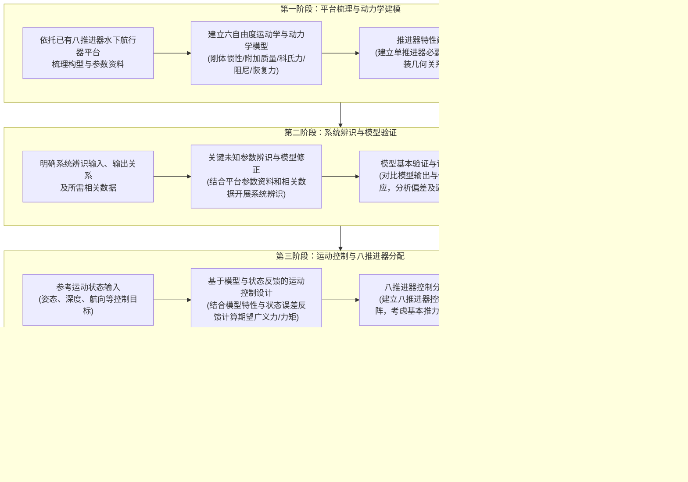
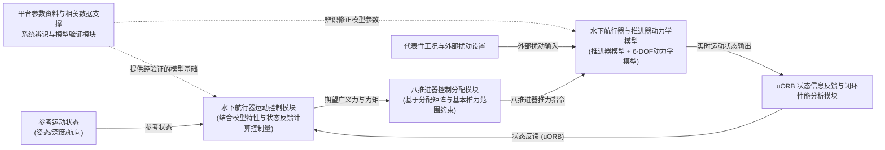

# 毕业论文开题报告

| 基本信息项 | 内容 |
| :--- | :--- |
| **课题名称** | 基于PX4的水下航行器模型控制方法研究 |
| **副 标 题** | （无） |
| **学 院** | 机械工程与机器人学院 |
| **专 业** | 机械设计制造及其自动化 |
| **学生姓名** | 张卫恒 |
| **学 号** | 2352407 |
| **日 期** | 2026 年 9 月 28 日 |

---

## 一、毕业论文课题背景

### 1． 课题来源及研究的目的和意义

#### （1）课题来源
本课题来源于实验室在水下无人系统与智能海洋装备方向的科研实践与工程开发需求，直接依托实验室已有的八推进器水下航行器（Unmanned Underwater Vehicle / Remotely Operated Vehicle，UUV/ROV）实验平台开展研究。

随着海洋强国建设与海洋资源开发的深入推进，水下无人航行器在海洋科学考察、海底矿产与油气管线巡检、海上风电基桩与水下结构物无损检测、水下大坝与跨海桥墩安全评估，以及现代海洋牧场自动化管护等诸多领域发挥着关键作用。在上述典型作业场景中，水下航行器往往需要贴近被测结构物作业，或在具有空间受限特征的水域中执行高精度的光学成像、声学测绘与机械臂操作。这些高难度任务对航行器的低速机动与自主悬停能力提出了严苛要求，要求航行器能够在复杂水流环境下稳定完成空间定点悬停、姿态定角保持（抵抗横滚与俯仰力矩倾斜）、高精度定深（克服重浮力微小失配与垂向流扰）以及航向锁定（定航）等基本运动控制任务。

实验室现有的八推进器水下航行器平台采用了典型的开架式（Open-frame）机械构型，具备八推进器空间对称与矢量倾斜布置的硬件驱动能力，已完成了基本的机械装配与推进器电控链路构建。然而，要在流体环境中实现高品质的自主闭环控制，仍面临诸多瓶颈：缺乏系统化的水动力建模与参数辨识，使得控制器难以获取物理平台的真实动力学特性；运动控制与推力分配多采用初级经验参数，未能在六自由度耦合层面上充分释放八推进器过驱动配置的协调潜力；控制系统软件缺乏工业级模块化规范，难以直接面向工程部署开展高可信度的闭环验证。为此，本课题立足于实验室已有平台的软硬件基础，围绕“动力学建模、系统辨识、模型运动控制、八推进器控制分配及 PX4/SITL 闭环仿真验证”开展系统性研究，具有坚实的工程实践背景与明确的技术升级需求。

#### （2）研究目的
水下航行器在黏性流体介质中运动时，在物理机理上呈现出极强的六自由度（6-DOF）非线性耦合特性。一方面，在流体动力学层面，航行器的运动不仅取决于刚体自身质量惯性矩阵，还强烈受到周围水体随体加速运动所产生的附加质量（Added Mass）效应的支配，附加质量的大小在许多低速和变加速工况下可与刚体自身质量相当；刚体与附加质量在旋转运动中伴随着复杂的科氏力与向心力耦合作用，流体黏性流动与开架式桁架、设备附体脱体涡则共同构成了包含线性与二次非线性项的水动力阻尼特性；此外，航行器重心（CG）与浮心（CB）的空间相对位置形成了具有自整定倾向但各向异性的静恢复力与力矩。在上述多源流体物理效应的综合作用下，航行器各运动轴之间存在显著的动力学交叉耦合。

另一方面，在工程实现层面，由于开架式航行器结构件复杂、附体繁多，常规的解析经验公式难以精确预测其全部水动力参数；加工装配公差、线缆悬垂张力、水密舱内部载荷装配位置偏差以及水体密度变化等物理因素，导致理论设计模型与物理平台的实际动态特性之间不可避免地存在参数偏差与未建模动态。此外，已有平台配备的八个推进器在空间呈三维非共面布置，构成了典型的过驱动冗余系统，运动控制器输出的六自由度期望广义力和力矩必须经过控制分配映射转化为各推进器的控制指令，且推进器在物理上受限于推力输出极限、正反转效率差异及推力死区等约束，极易在大幅机动时诱发局部执行器饱和与分配失真。

针对上述挑战，本课题的研究目的在于：
1. 建立能够准确描述已有八推进器水下航行器平台主要物理特性的六自由度运动学、动力学数学模型及单推进器特性模型，清晰刻画刚体惯性、附加质量、阻尼耗散及静水力恢复作用；
2. 明确系统辨识的输入激励与状态输出响应关系，充分利用已有平台的结构参数、设计资料及相关动态测试数据开展系统辨识，对影响主要动态特性的关键未知水动力参数进行辨识与修正；通过代表性工况下的动态响应对比进行模型验证，分析模型与相关数据之间的偏差及适用范围；
3. 以经验证的标称动力学模型为基础，结合航行器实时状态反馈构建闭环运动控制系统，将模型已知的动力学特性补偿与状态误差反馈控制相结合，计算实现姿态、深度和航向等基本运动状态稳定控制所需的期望广义力和力矩，并考察外部水流扰动与模型偏差对闭环性能的影响；
4. 依据已有八推进器平台的空间安装位置、推力方向与力臂关系构建控制分配矩阵，研究兼顾推进器基本推力输出范围的冗余推力求解方法，量化评估控制分配误差；
5. 基于工业级开源飞控软件 PX4 架构搭建软件在环（SITL）闭环仿真系统，通过 uORB 消息总线实现航行器动力学仿真模型、运动控制模块与八推进器控制分配模块的闭环集成，在代表性运动工况与流扰条件下开展仿真验证与量化性能评价，形成“已有平台—建模与系统辨识—模型验证—运动控制—控制分配—PX4/SITL闭环验证”的完整研究闭环。

#### （3）研究意义
本课题的研究在学术方法论探讨与工程应用实践两个层面均具有重要意义：

**第一，在理论与方法层面，深化了模型支撑下的水下航行器运动控制全链路分析体系。**
传统的无模型经验控制难以在多轴耦合与强阻尼环境下保证理想的动态响应品质，而过于依赖单一高精度解析模型的控制方法又常因水动力参数获取困难而难以在工程中有效落地。本课题坚持“机理建模与试验辨识相结合、模型信息与状态反馈相结合”的研究理念，通过机理推导理清六自由度方程的物理架构，借助系统辨识修正关键未知参数，获得满足控制设计精度要求的标称基准模型。在此基础上，将标称模型中的静回复力、主导阻尼与惯性耦合项引入控制前向通道进行主动补偿，同时依靠鲁棒的状态误差反馈抑制未建模残差与外部扰动，有助于揭示动力学模型保真度、控制律补偿结构与闭环动态抗扰性能之间的内在规律；同时，针对八推进器过驱动构型建立严密的控制分配与约束分析方法，能够为冗余推进器在复杂受力工况下的推力协同分配提供理论依据。

**第二，在工程应用与软件实践层面，构建了标准化、高可移植性的 PX4/SITL 水下飞控研发范式。**
传统水下机器人开发中普遍存在“在纯数学仿真环境中表现优异，但向机载嵌入式控制器移植时代码重构量巨大、软硬件接口脱节”的工程痛点。PX4 作为国际上广泛认可的高可靠开源自主无人系统操作系统，具有极度模块化的分层设计、微秒级实时调度机制以及基于 uORB 的松耦合消息通信总线。本课题依托 PX4 软件架构开展模块化代码设计，在 SITL 仿真环境中直接集成 6-DOF 动力学模型、运动控制器与八推进器分配算法，不仅可以在安全、低成本、高可重复的条件下全面测试算法在各类极限运动和外部水流扰动工况下的鲁棒性，还规范了状态估计、期望力矩输出及各推进器指令的标准数据接口。这为后续将算法直接部署至 Pixhawk 等机载嵌入式硬件并在实物平台上开展水池实验打下了坚实的软件工程基石。

---

### 2． 国内外在该方向的研究现状和发展趋势

围绕本课题所涉及的水下航行器六自由度动力学机理建模与参数辨识、基于模型与状态反馈的运动控制方法、多推进器受约束控制分配以及基于开源飞控软件（PX4）的闭环仿真等四个核心技术环节，国内外学术界与工业界开展了深入系统的研究。

#### （1）水下航行器动力学建模与系统辨识研究现状
在动力学机理建模方面，水下航行器的运动学与动力学理论体系历经数十年演进，已形成高度规范的标准框架。国际水池会议（ITTC）与国际海事组织（IMO）为海洋船舶与运载器的运动表述奠定了基础，挪威科技大学著名海洋控制学者 Fossen 系统提出了海洋航行器六自由度非线性矢量建模理论体系 [1]。该体系将固定于地球的惯性坐标系（NED）与固连于航行器的附体坐标系（Body-fixed Frame）相结合，通过坐标变换矩阵统一描述位置、姿态欧拉角与六自由度线速度、角速度，并将作用于机体上的广义力矩严格解构为刚体惯性矩阵、水动力附加质量矩阵、刚体与附加质量科氏向心力矩阵、线性与非线性水动力阻尼矩阵以及重力与浮力恢复力矩矢量，成为当前水下航行器建模与控制研究所公认的数学物理基石。

对于具有开放式骨架结构的 ROV 而言，其水动力特性与流线型鱼雷状 AUV 存在显著差异。开架式航行器通常挂载较多外部传感器探头、推进器短舱、照明灯组及耐压水密舱，表面形态高度不规则且内部水流可穿透骨架流动。Caccia 等较早对开架式可变构型无人水下航行器的动力学建模与水动力参数辨识展开了系统研究，指出了开架式航行器附加质量与阻尼矩阵中非对角耦合项的重要影响，验证了基于机理模型结构结合试验数据辨识主导水动力参数的可行性 [2]。

由于开架式航行器的水动力系数难以仅凭理论解析精确计算，结合试验手段与运行数据开展系统辨识成为获取可用工程模型的必经之路。在传统水动力测试中，平面运动机构（PMM）水池拖曳试验精度高但设备昂贵且周期长。为此，低成本、高效率的原位试验与动态响应辨识方法受到了研究者的广泛关注。Ross、Fossen 与 Johansen 提出了基于自由衰减试验（Free Decay Tests）辨识水下航行器水动力系数的方法，通过释放初始位移并记录单自由度衰减振荡曲线即可解算出主要惯性与阻尼参数，具有操作简便、物理直观的突出优点 [3]；Avila 等针对开架式水下航行器开展了系统化的实验水动力模型辨识研究，结合阶跃推力激励与频域响应分析对附加质量与流体阻尼特性进行了定量标定 [4]。在辨识算法演进方面，针对水下传感器在真实水体环境中不可避免的测量噪声，Liu 等探讨了最大似然估计（ML）在水下航行器非线性阻尼与附加质量辨识中的应用，显著提升了参数估计在统计意义上的一致性 [5]；Chin 与 Lau 针对复杂外形开架式 ROV 开展了水动力阻尼的数值建模与试验对比研究，分析了不同速度区间线性阻尼与二次非线性阻尼的主导权重 [6]。国内哈尔滨工程大学等团队在水动力参数数值计算与辨识领域亦取得了丰硕成果，如高婷、庞永杰等针对水下航行器复杂构型水动力系数计算方法开展了系统研究，结合几何特征分析、数值仿真与试验修正建立了面向控制设计的实用化模型 [7]。近年来，von Benzon 等面向主流八推进器 BlueROV2 平台建立了开源物理仿真与动力学基准，提供了标准化的辨识对比基础 [8]。这表明“基于机理构建总体方程骨架 + 依托平台资料与相关数据辨识修正关键未知量 + 利用代表性动态响应进行适用范围验证”的方法，已成为兼顾模型物理可解释性与工程可用性的主流路径。

#### （2）水下航行器运动控制方法研究现状
水下航行器运动控制的核心任务在于驱动推进器系统产生协调推力与力矩，使航行器的空间位置、潜深以及横滚、俯仰、偏航姿态稳定准确地跟踪给定的参考运动指令，并在存在未建模动态与外部水流干扰时维持良好的瞬态与稳态品质。

在早期的工程实际中，独立单回路 PID 或级联 PID 控制得到了广泛应用，其不依赖精确数学模型，通过误差积分消除稳态偏差，在平稳水流环境下的定点悬停或缓慢巡航中具备较好实用性 [1, 8]。然而，开架式八推进器水下航行器本质上是一个高度非线性、强耦合的多输入多输出（MIMO）动力学系统：航行器在水平面做快速纵向机动时易诱发明显的俯仰和垂荡运动；侧向位移时亦伴随着横滚力矩干扰；重力与浮力的非线性恢复力矩随姿态倾角呈三角函数非线性变化。若完全忽略这些物理耦合，纯线性 PID 控制难以兼顾不同运动工况下的控制品质，容易在大范围机动时出现超调过大甚至推进器高频颤振。

针对上述瓶颈，结合动力学模型已知特性与实时状态反馈的现代控制方法成为水下航行器控制领域的研究重点。Fernandes 等针对观察级 ROV 提出了一种基于高增益状态观测器的输出反馈运动控制系统，将航行器的标称动力学模型与状态重构相结合，仅依赖有限传感器输出即实现了深度、航向和水平面位置的稳定闭环控制，并通过理论分析与水池试验证明了有效性 [9]。Chu 等针对实际水下航行器普遍存在的推进器电机一阶动态延迟与推力幅值饱和问题，提出了一种融合动力学模型前馈补偿与自适应参数更新的轨迹跟踪控制方法，不仅显著降低了水动力阻尼参数不确定性对跟踪精度的影响，而且在推进器达到物理推力极限时表现出良好的闭环适应性 [10]。

与此同时，围绕非线性系统精确解耦，基于反馈线性化与动态逆思想的控制方法也得到了广泛探索。这类方法的核心思路在于利用动力学模型计算出抵消已知非线性项（如静水力恢复项、科氏力与主导阻尼项）所需的前馈控制力矩，将非线性耦合系统在名义上等效线性化为一个解耦的二阶积分器链路，简化了闭环状态反馈控制器的参数整定。此外，针对全状态精确机理模型难以获取的客观现实，国内外学者近年来进一步探索了增量非线性动态逆（INDI）等局部增量控制思想在水下航行器上的应用可行性，例如 Slawik 等探讨了将增量动态逆方法应用于特技作业 AUV 敏捷姿态控制的可行性，通过高频传感器反馈在局部时间微元内补偿模型不确定性，展现出优异的高频抗扰潜力 [11]。

综合国内外运动控制方法的发展演进可知，针对水下航行器的控制研究正在从单纯的理论算法推导向兼顾物理机理与工程可实现性稳步回归。面对模型不确定性与流体扰动，盲目依赖形式复杂的强自适应算法往往难以保证工程鲁棒性，而忽视模型信息则会导致控制效率低下。**当前公认最稳健的控制设计思路是：依托经验证的标称动力学模型，在控制回路中显式引入模型前馈或动态逆补偿以抵消主要已知的恢复力矩与主导流体效应，同时在反馈回路中融合实时状态误差开展稳健的状态反馈调节，在确保系统渐近稳定性的同时，为后续针对具体平台特性开展控制算法的横向比选与深入探索留出充分的技术弹性。**

#### （3）多推进器控制分配研究现状
对于配备八个推进器的全驱动开架式水下航行器而言，其独立的物理执行器通道数量（8 个推进器）严格大于空间六自由度广义力与力矩的数量（6 个控制维度），属于典型的过驱动（Over-actuated）冗余控制系统。上层运动控制器根据参考轨迹与当前状态误差计算出的是机体所需的合力与合力矩 $\boldsymbol{\tau}_c \in \mathbb{R}^6$，而实际作用于水体的则是各推进器产生的轴向推力矢量 $\boldsymbol{T} \in \mathbb{R}^8$。如何将低维的期望广义力矩合理、无失真地解算并映射为高维的各推进器控制指令，即为控制分配（Control Allocation）所要解决的关键课题。

Johansen 与 Fossen 在权威控制分配综述中，系统梳理了航空航天、海洋船舶与机器人领域中控制分配的理论体系 [12]。在无约束或弱约束条件下，基于几何映射矩阵的广义逆（伪逆）法由于具备解析形式、计算耗时微秒级，在工程中得到了最广泛的基础应用；通过在伪逆中引入对角加权矩阵（加权伪逆法），能够根据推进器物理尺寸、功率或安装力臂灵活分配控制权重。万磊、徐玉如与庞永杰等较早针对多推力器水下机器人的控制分配开展了开创性研究，探讨了基于广义逆与加权伪逆的推力协调方案，并进一步拓展到了推力器单点故障下的容错控制与重构分配领域 [13]。

然而，实际物理推进器均存在严苛的物理限制：推进器电机转速存在最高上限，导致正向推力与反向推力存在明确的幅值边界，且螺旋桨水动力特性决定了正转推力通常大于反转推力；同时，电机加速度与电调响应决定了推力变化率存在物理约束。若直接采用无约束伪逆求解，当某一个或多个推进器计算推力超出物理上限时，简单的截断饱和处理会导致实际产生的六维广义力和力矩方向发生偏转，即出现严重的“力矩交叉耦合失真”，进而危及姿态闭环稳定性。为此，带物理约束的推力分配优化算法成为了近年的研究重点。程卫平、王猛等针对水下机器人推力器物理输出上限，研究了基于可行方向法等处理推力边界约束的优化分配算法，有效克服了推力饱和导致的力矩分配畸变 [14]；孙广威等针对矢量推进 ROV 提出了兼顾推力约束与分配效率的多级推力分配策略，在多推进器协调与能耗抑制方面取得了良好效果 [15]。

由此可见，根据已有八推进器平台的空间安装位置、推力矢量方向及力臂关系，准确建立反映平台真实几何构型的 $6 \times 8$ 控制分配效能矩阵，并在求解流程中系统考虑推进器基本推力输出范围约束，是连接上层闭环运动控制器与底层执行机构不可或缺的核心纽带。

#### （4）基于开源软件架构（PX4）的水下航行器闭环仿真研究现状
在现代机器人与自主无人系统的研发流程中，控制算法的软件工程实现规范与闭环仿真验证平台扮演着与算法理论同等重要的角色。传统的以学术验证为主要目的的研究往往基于 MATLAB/Simulink 或纯 Python 环境编写离线数学仿真脚本，虽然易于验证控制方程的收敛性，但完全脱离了嵌入式操作系统（RTOS）的多任务并发调度、中断响应、进程间异步通信以及传感器离散采样抖动等真实物理环境限制，导致研究成果难以向工程物理平台顺畅过渡。

苏黎世联邦理工学院（ETH Zurich）Meier 等主导研发的 PX4 Autopilot 软件框架代表了当前开源机器人自主控制软件工程的最高水平之一 [16]。PX4 采用了严密的“算法层与系统中间件层”解耦设计哲学，底层运行在 NuttX 硬实时嵌入式操作系统上，核心数据链路依托基于共享内存的微对象请求代理（uORB）异步发布/订阅总线构建。在 PX4 架构中，传感器数据采集、状态估计（EKF2）、运动控制计算与执行器控制分配被严格划分为独立的 POSIX 任务或工作队列，各模块仅通过带有高精度时间戳的 uORB 消息进行数据交换。更为重要的是，PX4 原生支持 POSIX 环境下的软件在环（SITL）编译与运行，使得原生 C++ 飞控算法能够在 PC 端以接近实机的调度机制运行，并通过通信接口与外部流体仿真环境实现毫秒级数据闭环，同时依靠高频 ULog 黑匣子机制完整记录所有控制状态与分配残差数据。

最初，PX4 主要针对空中无人机进行深度优化。然而，凭借其标准化的控制分配模块与良好的可扩展性，近年来国内外研究机构开始积极将 PX4 引入水下无人航行器领域。德国汉堡工业大学 Hackbarth 等基于 PX4 架构成功研制了 HippoCampus 微型水下航行器，并在水池环境中完成了高机动姿态与编队协同控制验证，充分证实了复用 PX4 模块化控制架构开展水下机器人研发的高可靠性与高效率 [17]。

#### （5）发展趋势与对本课题的启示
综合上述四个领域的国内外研究现状，可以提炼出当前水下无人航行器控制领域的发展趋势与对本课题的关键启示：
1. **一体化链路协同演进趋势**：水下航行器的运动控制研究正在摆脱以往建模、辨识、控制、分配各自孤立的割裂状态，越来越强调“**机理建模为骨架—系统辨识定参数—模型信息补前馈—状态误差保稳定—控制分配定推力—飞控在环验闭环**”的全链路系统化研发；
2. **算法尺度与稳健性把控原则**：在水下非线性不确定性与强扰动背景下，盲目追求形式极端复杂的强自适应或过度拘泥于某一种先验假设严苛的窄门算法，极易在实际复杂多变的水流工况下出现鲁棒性不足；**最稳健、最具工程生命力的方法，是以充分验证的标称模型为基石，结合系统状态反馈构建通用且弹性的控制律框架，为后续结合实际辨识结果展开方法比选留出充分余地**；
3. **软件工程与数字在环验证趋势**：依托成熟的开源自主系统飞控架构（如 PX4）及其 SITL 软件在环仿真机制，已成为连接理论算法设计与实物水下平台部署的高速桥梁。

基于上述启示，本课题确立了以已有八推进器水下航行器为对象，系统推进六自由度动力学与推进器建模、基于相关数据的系统辨识与模型验证、基于模型和状态反馈的运动控制设计、八推进器控制分配以及基于 PX4/SITL 的闭环仿真验证研究，立题明确，具有坚实的学术支撑与广阔的工程应用前景。

---

## 二、毕业论文方案介绍

### 1． 主要研究内容

#### （1）预期研究目标
本课题依托已有八推进器水下航行器平台，建立能够反映航行器主要动态特性的六自由度动力学模型与推进器模型，结合平台参数资料和相关数据完成系统辨识与模型验证；在此基础上研究基于航行器模型和状态反馈的闭环运动控制方法及八推进器控制分配方案，并在PX4/SITL环境下构建完整闭环仿真系统，完成典型运动工况与适量外部扰动工况下的仿真验证与性能分析，形成“已有平台—建模与系统辨识—模型验证—运动控制—控制分配—PX4/SITL闭环验证”的完整研究体系。

#### （2）研究内容要点
围绕上述研究目标，本课题应完成的主要研究内容包括以下四个方面：

1. **水下航行器动力学建模与系统辨识**
   依托已有八推进器水下航行器平台，建立六自由度运动学与动力学模型，考虑刚体惯性、附加质量、科氏力与向心力、水动力阻尼、重力与浮力恢复作用等主要动力学因素，并结合已有平台推进器特性建立单个推进器或执行机构的必要模型。在理论动力学模型基础上，明确系统辨识的输入、输出及所需数据，结合平台参数资料和相关数据开展系统辨识，对模型中的关键未知量进行辨识和修正。通过代表性动态响应对模型进行验证，分析模型与相关数据之间的偏差及适用范围，得到用于运动控制设计和PX4/SITL闭环仿真的航行器模型。

2. **水下航行器运动控制方法研究**
   以建立并验证的航行器模型为基础，结合航行器动力学特性和状态反馈构建闭环运动控制系统。根据参考状态与当前状态之间的误差进行控制计算，形成航行器所需的期望广义力和力矩，实现姿态、深度和航向等基本运动状态的闭环控制。选取代表性运动工况分析跟踪性能和动态特性，并考察模型误差及外部扰动对闭环控制性能的影响。

3. **八推进器控制分配**
   根据已有八推进器平台的推进器安装位置、推力方向及力臂关系，建立各推进器推力与航行器广义力、力矩之间的映射关系及八推进器控制分配矩阵。针对八推进器配置，将运动控制模块输出的期望广义力和力矩转换为各推进器推力指令，并结合推进器实际输出范围考虑基本推力约束。结合控制分配误差和各推进器输出情况分析分配效果。

4. **PX4/SITL 闭环仿真与系统验证**
   在PX4/SITL环境下构建由航行器动力学模型、运动控制模块和八推进器控制分配模块组成的闭环仿真系统，通过uORB完成必要的状态信息、控制量和推进器指令交互。选取代表性运动工况并设置相应扰动条件，考察闭环系统的动态特性和控制效果；结合跟踪误差、动态响应和控制分配误差等必要指标进行性能分析，验证闭环系统的控制效果。

---

### 2． 研究方案

#### （1）拟采取的研究方法
本课题采用理论机理建模、数据驱动参数辨识、基于模型与状态反馈的控制设计以及软件在环闭环仿真相结合的研究方法，在明确总体技术框架的同时，为各模块具体算法形式的比选与优化留出合理空间：

1. **六自由度动力学与推进器建模方法**
   建立北东地惯性坐标系与附体坐标系，设航行器广义位置与姿态矢量为 $\boldsymbol{\eta} = [x, y, z, \phi, \theta, \psi]^T$，附体系下线速度与角速度矢量为 $\boldsymbol{\nu} = [u, v, w, p, q, r]^T$。综合刚体动力学与水动力作用，建立六自由度运动学与动力学基本方程：
   $$\dot{\boldsymbol{\eta}} = \boldsymbol{J}(\boldsymbol{\eta})\boldsymbol{\nu}$$
   $$\boldsymbol{M}\dot{\boldsymbol{\nu}} + \boldsymbol{C}(\boldsymbol{\nu})\boldsymbol{\nu} + \boldsymbol{D}(\boldsymbol{\nu})\boldsymbol{\nu} + \boldsymbol{g}(\boldsymbol{\eta}) = \boldsymbol{\tau} + \boldsymbol{\tau}_d$$
   式中，$\boldsymbol{J}(\boldsymbol{\eta})$ 为坐标转换矩阵；$\boldsymbol{M} = \boldsymbol{M}_{RB} + \boldsymbol{M}_A$ 为刚体惯性与附加质量矩阵；$\boldsymbol{C}(\boldsymbol{\nu})$ 为科氏力与向心力矩阵；$\boldsymbol{D}(\boldsymbol{\nu})$ 为包含线性与非线性项的水动力阻尼矩阵；$\boldsymbol{g}(\boldsymbol{\eta})$ 为重力与浮力恢复力矢量；$\boldsymbol{\tau}$ 为推进器产生的广义控制力与力矩矢量；$\boldsymbol{\tau}_d$ 为外部扰动项。同时，结合已有平台推进器参数资料，建立单推进器控制输入到推力输出的静态映射与必要动态模型。

2. **系统辨识与模型验证方法**
   结合已有八推进器平台的几何结构与质量参数确定先验已知量，梳理出主导各自由度动态响应的关键未知水动力参数集 $\boldsymbol{\theta}$。根据动力学方程构造输入（推进器推力或广义控制力）与输出（速度、姿态、深度等动态响应）之间的辨识关系，利用平台参数资料及相关测试/仿真响应数据对未知参数 $\boldsymbol{\theta}$ 进行参数估计与修正。随后，通过代表性动态响应对比模型输出与相关数据，定量评估模型偏差并明确模型适用范围。

3. **基于模型与状态反馈的运动控制及八推进器控制分配方法**
   以经验证的航行器模型为基础，设参考状态为 $\boldsymbol{\eta}_r$，定义姿态、深度与航向等状态跟踪误差 $\boldsymbol{e}_{\eta} = \boldsymbol{\eta}_r - \boldsymbol{\eta}$ 及速度误差 $\boldsymbol{e}_{\nu} = \boldsymbol{\nu}_r - \boldsymbol{\nu}$。结合标称模型信息（$\hat{\boldsymbol{M}}, \hat{\boldsymbol{C}}, \hat{\boldsymbol{D}}, \hat{\boldsymbol{g}}$）与实时状态反馈，设计闭环运动控制律计算期望广义力和力矩 $\boldsymbol{\tau}_c$：
   $$\boldsymbol{\tau}_c = \mathcal{F}_{\text{model}}(\hat{\boldsymbol{M}}, \hat{\boldsymbol{C}}, \hat{\boldsymbol{D}}, \hat{\boldsymbol{g}}, \boldsymbol{\eta}, \boldsymbol{\nu}, \boldsymbol{\eta}_r, \boldsymbol{\nu}_r) + \mathcal{F}_{\text{fb}}(\boldsymbol{e}_{\eta}, \boldsymbol{e}_{\nu})$$
   该通用结构将基于航行器模型的动态特性补偿项 $\mathcal{F}_{\text{model}}(\cdot)$ 与基于状态误差的反馈控制项 $\mathcal{F}_{\text{fb}}(\cdot)$ 相结合，可根据后续模型验证结果与控制需求灵活设计具体的模型补偿或动态逆反馈形式。在此基础上，根据八推进器安装位置 $\boldsymbol{r}_i$、推力方向 $\boldsymbol{d}_i$ 及力臂关系构建 $6 \times 8$ 控制分配矩阵 $\boldsymbol{B}$，在推进器基本推力输出范围 $\boldsymbol{T}_{\min} \le \boldsymbol{T} \le \boldsymbol{T}_{\max}$ 约束下，将期望广义力与力矩 $\boldsymbol{\tau}_c$ 分配为各推进器推力指令 $\boldsymbol{T} = [T_1, \dots, T_8]^T$，并结合分配误差 $\boldsymbol{e}_{\tau} = \boldsymbol{\tau}_c - \boldsymbol{B}\boldsymbol{T}$ 分析分配效果。

4. **PX4/SITL闭环仿真验证方法**
   利用PX4模块化软件架构与uORB发布/订阅消息机制，在SITL环境中将辨识验证后的水下航行器动力学模型、运动控制模块与八推进器控制分配模块集成为闭环系统，设置姿态、深度、航向等典型运动工况及适量外部扰动条件开展闭环仿真，综合跟踪误差、动态响应指标及控制分配误差验证系统性能。

---

#### （2）技术路线图

本课题的总体研究技术路线如图 1 所示，基于PX4/SITL的水下航行器闭环仿真系统结构框图如图 2 所示。

##### 1）课题总体研究技术路线图（Mermaid 可编辑源码与高清图）

##### 2）基于 PX4/SITL 的水下航行器闭环仿真系统结构框图（Mermaid 可编辑源码与高清图）

---

#### （3）可行性分析

1. **理论与方法可行性**
   水下航行器六自由度动力学建模（Fossen模型框架）、系统参数辨识、基于模型与状态反馈的运动控制以及多推进器控制分配矩阵求解均具有成熟完备的理论体系。各研究模块之间物理接口清晰（以运动状态、期望广义力/力矩、各推进器推力指令依次传递），理论方案合理可行。

2. **平台与数据基础可行性**
   本课题直接依托实验室已有八推进器水下航行器平台开展研究，平台几何构型、质量惯性属性、推进器安装布置及相关参数数据具备良好基础，能够为动力学建模、系统辨识、模型验证及八推进器控制分配矩阵建立提供可靠的数据支撑。

3. **软件与仿真环境可行性**
   PX4开源软件框架提供了完善的SITL软件在环仿真环境、标准化的uORB模块间通信机制以及ULog数据记录工具。前期已完成PX4架构与控制链路调研及基础仿真环境测试，具备在规定时间内完成模块集成与多工况仿真验证的软硬件条件。

---

### 3． 工作进度安排

根据学校毕业论文总体进程与任务书要求，本课题各阶段工作进度安排如下表所示：

| 序 号 | 论文各阶段名称 | 时间安排（教学周） |
| :---: | :--- | :---: |
| 1 | 课题申报、审核 | 2026.7.13~2026.7.24（第20~21周） |
| 2 | 学生选课、选题 | 2026.8.4~2026.8.7（第23周） |
| 3 | 下达任务书及任务书审核 | 2026.8.17~2026.8.21（第25周） |
| 4 | 编写开题报告、开题答辩、提交开题报告、审核 | 2026.9.16~2026.10.9（第1~4周） |
| 5 | 水下航行器动力学与推进器建模、PX4/SITL基础环境搭建 | 2026.10.12~2026.11.20（第5~10周） |
| 6 | 系统辨识与模型验证、运动控制方法研究 | 2026.11.23~2026.12.25（第11~15周） |
| 7 | 中期检查及中期答辩 | 2026.12.28~2027.1.15（第16~18周） |
| 8 | 运动控制、八推进器控制分配及PX4/SITL闭环集成 | 2027.2.22~2027.3.12（第1～3周） |
| 9 | SITL闭环仿真、典型工况验证与结果分析 | 2027.3.15~2027.4.2（第4～6周） |
| 10 | 论文撰写与仿真补充 | 2027.4.5~2027.4.16（第7～8周） |
| 11 | 论文查重、导师评阅、专家评阅、学生修改完善论文并定稿、毕业答辩 | 2027.4.19~2027.4.28（第9～10周） |
| 12 | 论文评优、论文各类资料（书面版和电子版）整理、归档 | 2027.5.3~2027.5.14（第11～12周） |

---

## 三、毕业论文的主要参考文献

[1] Fossen T I. Handbook of Marine Craft Hydrodynamics and Motion Control[M]. 2nd ed. Chichester, UK: John Wiley & Sons, 2021. DOI: 10.1002/9781119575016.

[2] Caccia M, Indiveri G, Veruggio G. Modeling and identification of open-frame variable configuration unmanned underwater vehicles[J]. IEEE Journal of Oceanic Engineering, 2000, 25(2): 227-240. DOI: 10.1109/48.838986.

[3] Ross A, Fossen T I, Johansen T A. Identification of underwater vehicle hydrodynamic coefficients using free decay tests[J]. IFAC Proceedings Volumes, 2004, 37(10): 363-368. DOI: 10.1016/S1474-6670(17)31759-7.

[4] Avila J P J, Donha D C, Adamowski J C. Experimental model identification of open-frame underwater vehicles[J]. Ocean Engineering, 2013, 60: 81-94. DOI: 10.1016/j.oceaneng.2012.10.007.

[5] Liu J C, Liu X M, Xu Y R. Application of ML to system identification for underwater vehicle[J]. Journal of Marine Science and Application, 2002, 1(1): 21-25. DOI: 10.1007/BF02921412.

[6] Chin C, Lau M. Modeling and testing of hydrodynamic damping model for a complex-shaped remotely-operated vehicle for control[J]. Journal of Marine Science and Application, 2012, 11(2): 150-163. DOI: 10.1007/s11804-012-1117-2.

[7] 高婷, 庞永杰, 王亚星, 等. 水下航行器水动力系数计算方法[J]. 哈尔滨工程大学学报, 2019, 40(1): 174-180.

[8] von Benzon M, Sørensen F F, Uth E, et al. An Open-Source Benchmark Simulator: Control of a BlueROV2 Underwater Robot[J]. Journal of Marine Science and Engineering, 2022, 10(12): 1898. DOI: 10.3390/jmse10121898.

[9] Fernandes D A, Sørensen A J, Pettersen K Y, Donha D C. Output feedback motion control system for observation class ROVs based on a high-gain state observer: Theoretical and experimental results[J]. Control Engineering Practice, 2015, 39: 90-102. DOI: 10.1016/j.conengprac.2014.12.005.

[10] Chu Z, Xiang X, Zhu D, et al. Adaptive trajectory tracking control for remotely operated vehicles considering thruster dynamics and saturation constraints[J]. ISA Transactions, 2020, 100: 28-37. DOI: 10.1016/j.isatra.2019.11.032.

[11] Slawik T, Vyas S, Christensen L, et al. Attitude Control of the Hydrobatic Intervention AUV Cuttlefish using Incremental Nonlinear Dynamic Inversion[C]//2024 IEEE/RSJ International Conference on Intelligent Robots and Systems (IROS). Abu Dhabi, UAE: IEEE, 2024: 781-787. DOI: 10.1109/IROS58592.2024.10801686.

[12] Johansen T A, Fossen T I. Control allocation—A survey[J]. Automatica, 2013, 49(5): 1087-1103. DOI: 10.1016/j.automatica.2013.01.035.

[13] 万磊, 徐玉如, 庞永杰. 水下机器人推力器容错控制技术的研究[J]. 机器人, 2003, 25(6): 510-514.

[14] 程卫平, 王猛, 曾现敏, 等. 基于可行方向法的水下机器人推力分配[J]. 舰船科学技术, 2022, 44(13): 102-106.

[15] 孙广威, 苏玉玺, 毛义, 等. 基于模糊逻辑的混合推进ROV多级推力分配策略[J]. 机器人, 2023, 45(4): 472-482.

[16] Meier L, Honegger D, Pollefeys M. PX4: A node-based multithreaded open source robotics framework for deeply embedded platforms[C]//2015 IEEE International Conference on Robotics and Automation (ICRA). Seattle, WA: IEEE, 2015: 6235-6240. DOI: 10.1109/ICRA.2015.7140074.

[17] Hackbarth A, Duecker D A, Kreuzer E. HippoCampus: A micro underwater vehicle for swarm applications[C]//2015 IEEE/RSJ International Conference on Intelligent Robots and Systems (IROS). Hamburg, Germany: IEEE, 2015: 1096-1101. DOI: 10.1109/IROS.2015.7353506.
