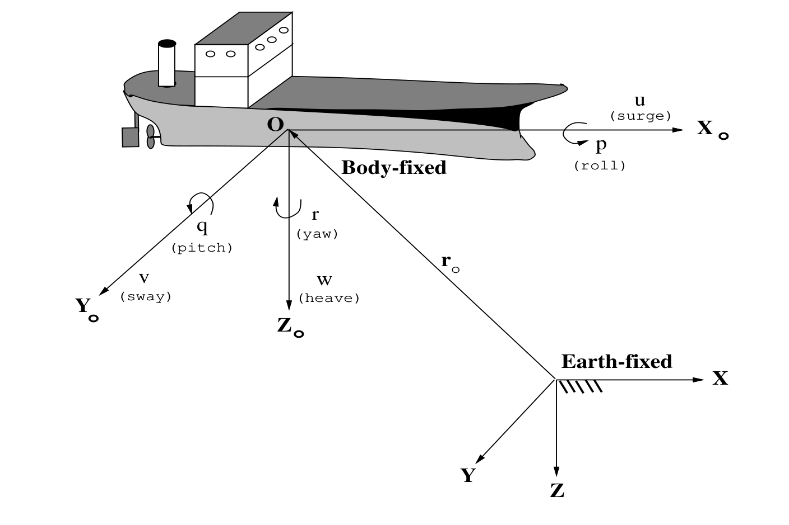

# 海洋航行器六自由度非线性建模 (Nonlinear Modelling of Marine Vehicles in 6 Degrees of Freedom)
### 100% 逐段逐句中英双语对照精读版 (Complete Unabridged Bilingual Edition)

> **英文原题 (Original Title)**: Nonlinear Modelling of Marine Vehicles in 6 Degrees of Freedom  
> **论文作者 (Authors)**: Thor I. Fossen, Ola-Erik Fjellstad  
> **作者单位 (Affiliation)**: 挪威理工学院工程控制系 (The Norwegian Institute of Technology, Department of Engineering Cybernetics, NTNU)  
> **发表刊物 (Publication)**: *Journal of Mathematical Modelling of Systems*, Vol. 1, No. 1, 1995, pp. 17–27  
> **学术定位**: 海洋航行器六自由度（6-DOF）非线性动力学统一矢量化机理建模奠基之作。

---

## 摘要 (Abstract)

<strong>[EN]</strong> In this paper a unified framework for vectorial parameterisation of inertia, Coriolis and centrifugal, and hydrodynamic added mass forces for marine vehicles in 6 degrees of freedom (DOF) is presented. Emphases is placed on representing the 6 DOF nonlinear marine vehicle equations of motion in vector form satisfying certain matrix properties like symmetry, skew-symmetry and positive definiteness. For marine vehicles, this problem was first addressed by Fossen [1]. The proposed representations in this paper are based on extensions of this work. The main results are presented as two theorems. The first theorem is derived by applying Newton's equations whereas the second theorem reviews the main results of Sagatun and Fossen [6] where the Lagrangian formalism is applied.

<strong>[中文]</strong> 在本文中，提出了一个用于海洋航行器在六自由度（6 DOF）下刚体惯性力、科氏力与向心力以及流体动力附加质量力的矢量参数化统一理论框架。研究的重点在于将六自由度非线性海洋航行器运动方程表达为满足特定矩阵代数性质（如对称性、反对称性与正定性）的紧凑矢量形式。对于海洋航行器，该问题最早由 Fossen [1] 展开探索。本文提出的表示方法是基于前期工作的深入拓展。主要理论成果以两个核心定理的形式呈现：第一个定理严格通过应用牛顿方程推导得出；第二个定理则回顾并统一了 Sagatun 和 Fossen [6] 应用拉格朗日分析力学形式所获得的主要成果。

<strong>关键词 (Key words)</strong>: 建模 (Modelling), 海洋航行器 (Marine vehicles), 运动方程 (Equations of motion), 拉格朗日力学与牛顿力学 (Lagrangian and Newtonian mechanics).

---

## 1. 引言 (1. Introduction)

<strong>[EN]</strong> In order to describe the motion of a marine vehicle in 6 degrees of freedom (DOF), 6 independent coordinates representing position and attitude are necessary. The 6 different motion components are defined as: surge, sway, heave, roll, pitch and yaw (see Table 1).

<strong>[中文]</strong> 为了描述海洋航行器在六自由度（6 DOF）下的空间运动，必须引入 6 个表示位置和姿态的独立广义坐标。这 6 个不同的运动分量定义为：纵荡（surge）、横荡（sway）、垂荡（heave）、横滚（roll）、俯仰（pitch）以及偏航（yaw）（见表 1）。

### 表 1：海洋航行器六自由度运动分量定义 (Table 1: 6 DOF motion components for a marine vehicle)

| 自由度 (DOF) | 运动分量与物理方向 (Motions) | 作用力与力矩 (Forces and Moments) | 附体系速度 (Body-Fixed Velocities) | 惯性系位置与欧拉角 (Inertial Position and Euler Angles) |
| :---: | :--- | :---: | :---: | :---: |
| 1 | motions in the x-direction (纵荡, surge) | $X$ | $u$ | $x$ |
| 2 | motions in the y-direction (横荡, sway) | $Y$ | $v$ | $y$ |
| 3 | motions in the z-direction (垂荡, heave) | $Z$ | $w$ | $z$ |
| 4 | rotation about the x-axis (横滚, roll) | $K$ | $p$ | $\phi$ |
| 5 | rotation about the y-axis (俯仰, pitch) | $M$ | $q$ | $\theta$ |
| 6 | rotation about the z-axis (偏航, yaw) | $N$ | $r$ | $\psi$ |

<strong>[EN]</strong> Hence the general motion of a marine vehicle in 6 DOF can be described by the following vectors:

<strong>[中文]</strong> 据此，海洋航行器在六自由度空间中的一般运动状态可以用以下标准矢量表达：

$$
\boldsymbol{\eta} = \begin{bmatrix} \boldsymbol{\eta}_1 \\ \boldsymbol{\eta}_2 \end{bmatrix}; \quad \boldsymbol{\eta}_1 = [x, y, z]^T; \quad \boldsymbol{\eta}_2 = [\phi, \theta, \psi]^T
$$
$$
\boldsymbol{\nu} = \begin{bmatrix} \boldsymbol{\nu}_1 \\ \boldsymbol{\nu}_2 \end{bmatrix}; \quad \boldsymbol{\nu}_1 = [u, v, w]^T; \quad \boldsymbol{\nu}_2 = [p, q, r]^T
$$
$$
\boldsymbol{\tau} = \begin{bmatrix} \boldsymbol{\tau}_1 \\ \boldsymbol{\tau}_2 \end{bmatrix}; \quad \boldsymbol{\tau}_1 = [X, Y, Z]^T; \quad \boldsymbol{\tau}_2 = [K, M, N]^T
$$

<strong>[EN]</strong> where $\boldsymbol{\eta}$ denotes the earth-fixed position and attitude vector, $\boldsymbol{\nu}$ denotes the body-fixed linear and angular velocity vector and $\boldsymbol{\tau}$ is used to describe the forces and moments acting on the vehicle in the body-fixed frame. The body-fixed and inertial reference frames are shown in Figure 1.

<strong>[中文]</strong> 其中 $\boldsymbol{\eta}$ 表示地球固连惯性坐标系（北-东-地 NED 坐标系）下的位置与欧拉角姿态矢量；$\boldsymbol{\nu}$ 表示固连于航行器机体的附体坐标系（前-右-下 FRD 坐标系）下的线速度与角速度矢量；$\boldsymbol{\tau}$ 用于描述在附体坐标系下作用于航行器机体上的广义力与力矩。附体参考坐标系 $\{b\}$ 与惯性参考坐标系 $\{n\}$ 的几何关系如图 1 所示。

<strong>[EN]</strong> The kinematic equations of motion relate the body-fixed velocities to the earth-fixed position and attitude rates through the transformations:

<strong>[中文]</strong> 六自由度运动学方程通过以下坐标变换矩阵将附体系速度与惯性系位置及姿态变化率关联起来：

$$
\dot{\boldsymbol{\eta}}_1 = \boldsymbol{J}_1(\boldsymbol{\eta}_2)\boldsymbol{\nu}_1, \quad \dot{\boldsymbol{\eta}}_2 = \boldsymbol{J}_2(\boldsymbol{\eta}_2)\boldsymbol{\nu}_2
$$
$$
\dot{\boldsymbol{\eta}} = \boldsymbol{J}(\boldsymbol{\eta})\boldsymbol{\nu} = \begin{bmatrix} \boldsymbol{J}_1(\boldsymbol{\eta}_2) & \boldsymbol{0}_{3 \times 3} \\ \boldsymbol{0}_{3 \times 3} & \boldsymbol{J}_2(\boldsymbol{\eta}_2) \end{bmatrix} \begin{bmatrix} \boldsymbol{\nu}_1 \\ \boldsymbol{\nu}_2 \end{bmatrix}
$$

---

## 2. 牛顿力学方法 (2. Newtonian Approach)

<strong>[EN]</strong> The motion of a rigid body with respect to a body-fixed rotating reference frame $X_0 Y_0 Z_0$ with origin $O$ is given by Newton's laws:

<strong>[中文]</strong> 刚体相对于原点为 $O$ 的附体旋转参考坐标系 $X_0 Y_0 Z_0$ 的运动由牛顿运动定律严格给出：

$$
m \left[ \dot{\boldsymbol{\nu}}_1 + \boldsymbol{\nu}_2 \times \boldsymbol{\nu}_1 + \dot{\boldsymbol{\nu}}_2 \times \boldsymbol{r}_G + \boldsymbol{\nu}_2 \times (\boldsymbol{\nu}_2 \times \boldsymbol{r}_G) \right] = \boldsymbol{\tau}_1 \tag{1}
$$
$$
\boldsymbol{I}_0 \dot{\boldsymbol{\nu}}_2 + \boldsymbol{\nu}_2 \times (\boldsymbol{I}_0 \boldsymbol{\nu}_2) + m \boldsymbol{r}_G \times (\dot{\boldsymbol{\nu}}_1 + \boldsymbol{\nu}_2 \times \boldsymbol{\nu}_1) = \boldsymbol{\tau}_2 \tag{2}
$$

<strong>[EN]</strong> where $\boldsymbol{r}_G = [x_G, y_G, z_G]^T$ is the centre of gravity and $\boldsymbol{I}_0$ is the inertia tensor with respect to the origin $O$ of the body-fixed reference frame, that is:

<strong>[中文]</strong> 其中 $\boldsymbol{r}_G = [x_G, y_G, z_G]^T$ 为重心在附体坐标系下的位置矢量，$\boldsymbol{I}_0$ 为刚体关于附体系原点 $O$ 的转动惯量张量，即：

$$
\boldsymbol{I}_0 = \begin{bmatrix}
I_x & -I_{xy} & -I_{xz} \\
-I_{yx} & I_y & -I_{yz} \\
-I_{zx} & -I_{zy} & I_z
\end{bmatrix}; \quad \boldsymbol{I}_0 = \boldsymbol{I}_0^T > 0; \quad \dot{\boldsymbol{I}}_0 = \boldsymbol{0} \tag{3}
$$

<strong>[EN]</strong> Defining the skew-symmetric cross-product operator $S(\boldsymbol{\lambda})$ such that $S(\boldsymbol{\lambda})\boldsymbol{a} = \boldsymbol{\lambda} \times \boldsymbol{a}$, the rigid-body inertia matrix $\boldsymbol{M}_{RB}$ can be determined directly from (1) and (2):

<strong>[中文]</strong> 定义满足 $S(\boldsymbol{\lambda})\boldsymbol{a} = \boldsymbol{\lambda} \times \boldsymbol{a}$ 的反对称叉乘算子 $S(\boldsymbol{\lambda})$，刚体质量惯性矩阵 $\boldsymbol{M}_{RB}$ 可直接由方程 (1) 和 (2) 确定：

$$
\boldsymbol{M}_{RB}\dot{\boldsymbol{\nu}} = \begin{bmatrix}
m\dot{\boldsymbol{\nu}}_1 + m\dot{\boldsymbol{\nu}}_2 \times \boldsymbol{r}_G \\
\boldsymbol{I}_0 \dot{\boldsymbol{\nu}}_2 + m\boldsymbol{r}_G \times \dot{\boldsymbol{\nu}}_1
\end{bmatrix} \tag{4}
$$
$$
\boldsymbol{M}_{RB} = \begin{bmatrix}
m\boldsymbol{I}_{3 \times 3} & -m S(\boldsymbol{r}_G) \\
m S(\boldsymbol{r}_G) & \boldsymbol{I}_0
\end{bmatrix}
$$
$$
\boldsymbol{M}_{RB} = \begin{bmatrix}
m & 0 & 0 & 0 & m z_G & -m y_G \\
0 & m & 0 & -m z_G & 0 & m x_G \\
0 & 0 & m & m y_G & -m x_G & 0 \\
0 & -m z_G & m y_G & I_x & -I_{xy} & -I_{xz} \\
m z_G & 0 & -m x_G & -I_{yx} & I_y & -I_{yz} \\
-m y_G & m x_G & 0 & -I_{zx} & -I_{zy} & I_z
\end{bmatrix} = \boldsymbol{M}_{RB}^T > 0 \tag{5}
$$

---

### 2.1 刚体科氏力与向心力矩阵 (2.1 Rigid-Body Coriolis and Centripetal Matrix)

<strong>[EN]</strong> The Coriolis and centripetal matrix can be represented in numerous ways. Two skew-symmetrical representations motivated from Newton's laws are given by Theorem 1.

<strong>[中文]</strong> 科氏力与向心力矩阵可以用多种方式来表示。基于牛顿定律推导得出的两种反对称表示形式由定理 1 给出。

**【定理 1 (Theorem 1)】**

<strong>[EN]</strong> i) The Coriolis and centripetal matrix can be parameterised according to:

<strong>[中文]</strong> 形式 i)：刚体科氏力与向心力矩阵可参数化为如下纯反对称形式：

$$
\boldsymbol{C}_{RB}(\boldsymbol{\nu}) = \begin{bmatrix}
\boldsymbol{0}_{3 \times 3} & -m S(\boldsymbol{\nu}_1) - m S(\boldsymbol{\nu}_2)S(\boldsymbol{r}_G) \\
-m S(\boldsymbol{\nu}_1) + m S(\boldsymbol{r}_G)S(\boldsymbol{\nu}_2) & -S(\boldsymbol{I}_0 \boldsymbol{\nu}_2)
\end{bmatrix} \tag{8}
$$

$$
\boldsymbol{C}_{RB}(\boldsymbol{\nu}) = \begin{bmatrix}
0 & 0 & 0 & c_{14} & c_{15} & c_{16} \\
0 & 0 & 0 & c_{24} & c_{25} & c_{26} \\
0 & 0 & 0 & c_{34} & c_{35} & c_{36} \\
-c_{14} & -c_{24} & -c_{34} & 0 & c_{45} & c_{46} \\
-c_{15} & -c_{25} & -c_{35} & -c_{45} & 0 & c_{56} \\
-c_{16} & -c_{26} & -c_{36} & -c_{46} & -c_{56} & 0
\end{bmatrix} \tag{9}
$$
其中：
$$
\begin{aligned}
c_{14} &= m(y_G q + z_G r), \quad c_{15} = -m(x_G q - w), \quad c_{16} = -m(x_G r + v) \\
c_{24} &= -m(y_G p + w), \quad c_{25} = m(z_G r + x_G p), \quad c_{26} = -m(y_G r - u) \\
c_{34} &= -m(z_G p - v), \quad c_{35} = -m(z_G q + u), \quad c_{36} = m(x_G p + y_G q) \\
c_{45} &= -I_{yz} q - I_{xz} p + I_z r \\
c_{46} &= I_{yz} r + I_{xy} p - I_y q \\
c_{56} &= -I_{xz} r - I_{xy} q + I_x p
\end{aligned}
$$

<strong>[EN]</strong> ii) An alternative skew-symmetric representation is:

<strong>[中文]</strong> 形式 ii)：另一种等价的反对称表示形式为：

$$
\boldsymbol{C}_{RB}(\boldsymbol{\nu}) = \begin{bmatrix}
\boldsymbol{0}_{3 \times 3} & -m S(\boldsymbol{\nu}_1) - m S(S(\boldsymbol{\nu}_2)\boldsymbol{r}_G) \\
-m S(\boldsymbol{\nu}_1) - m S(S(\boldsymbol{\nu}_2)\boldsymbol{r}_G) & m S(S(\boldsymbol{\nu}_1)\boldsymbol{r}_G) - S(\boldsymbol{I}_0 \boldsymbol{\nu}_2)
\end{bmatrix} = \begin{bmatrix}
\boldsymbol{0}_{3 \times 3} & \boldsymbol{C}_{12}(\boldsymbol{\nu}) \\
-\boldsymbol{C}_{12}^T(\boldsymbol{\nu}) & \boldsymbol{C}_{22}(\boldsymbol{\nu})
\end{bmatrix} \tag{10, 11}
$$
其中：
$$
\boldsymbol{C}_{12}(\boldsymbol{\nu}) = \begin{bmatrix}
0 & m(w - q x_G + p y_G) & -m(v + r x_G - p z_G) \\
-m(w - q x_G + p y_G) & 0 & m(u - r y_G + q z_G) \\
m(v + r x_G - p z_G) & -m(u - r y_G + q z_G) & 0
\end{bmatrix} \tag{12}
$$
$$
\boldsymbol{C}_{22}(\boldsymbol{\nu}) = \begin{bmatrix}
0 & -I_{yz} q - I_{xz} p + I_z r & I_{yz} r + I_{xy} p - I_y q \\
I_{yz} q + I_{xz} p - I_z r & 0 & -I_{xz} r - I_{xy} q + I_x p \\
-I_{yz} r - I_{xy} p + I_y q & I_{xz} r + I_{xy} q - I_x p & 0
\end{bmatrix} \tag{13}
$$

<strong>[EN]</strong> <strong>Proof:</strong> The remaining terms in (1) and (2) after terms associated with $\dot{\boldsymbol{\nu}}_1$ and $\dot{\boldsymbol{\nu}}_2$ are removed can be written:

<strong>[中文]</strong> <strong>证明：</strong>在方程 (1) 和 (2) 中剔除加速度项后，科氏与向心项满足：

$$
\boldsymbol{C}_{RB}(\boldsymbol{\nu})\boldsymbol{\nu} = \begin{bmatrix}
m \left[ \boldsymbol{\nu}_2 \times \boldsymbol{\nu}_1 + \boldsymbol{\nu}_2 \times (\boldsymbol{\nu}_2 \times \boldsymbol{r}_G) \right] \\
\boldsymbol{\nu}_2 \times (\boldsymbol{I}_0 \boldsymbol{\nu}_2) + m \boldsymbol{r}_G \times (\boldsymbol{\nu}_2 \times \boldsymbol{\nu}_1)
\end{bmatrix} \tag{14}
$$

<strong>[EN]</strong> Using the vector triple product identities $\boldsymbol{a} \times (\boldsymbol{b} \times \boldsymbol{c}) = S(\boldsymbol{a})S(\boldsymbol{b})\boldsymbol{c}$ and $(\boldsymbol{a} \times \boldsymbol{b}) \times \boldsymbol{c} = S(S(\boldsymbol{a})\boldsymbol{b})\boldsymbol{c}$, together with the Jacobi identity:

<strong>[中文]</strong> 应用矢量三重积展开式 $\boldsymbol{a} \times (\boldsymbol{b} \times \boldsymbol{c}) = S(\boldsymbol{a})S(\boldsymbol{b})\boldsymbol{c}$ 与 $(\boldsymbol{a} \times \boldsymbol{b}) \times \boldsymbol{c} = S(S(\boldsymbol{a})\boldsymbol{b})\boldsymbol{c}$，结合雅可比恒等式：

$$
\boldsymbol{a} \times (\boldsymbol{b} \times \boldsymbol{c}) + \boldsymbol{b} \times (\boldsymbol{c} \times \boldsymbol{a}) + \boldsymbol{c} \times (\boldsymbol{a} \times \boldsymbol{b}) = \boldsymbol{0} \tag{20}
$$

<strong>[EN]</strong> yields $m \boldsymbol{r}_G \times (\boldsymbol{\nu}_2 \times \boldsymbol{\nu}_1) = -m S(S(\boldsymbol{\nu}_2)\boldsymbol{r}_G)\boldsymbol{\nu}_1 + m S(S(\boldsymbol{\nu}_1)\boldsymbol{r}_G)\boldsymbol{\nu}_2$. This completes the proof of Theorem 1. $\blacksquare$

<strong>[中文]</strong> 即可导出 $m \boldsymbol{r}_G \times (\boldsymbol{\nu}_2 \times \boldsymbol{\nu}_1) = -m S(S(\boldsymbol{\nu}_2)\boldsymbol{r}_G)\boldsymbol{\nu}_1 + m S(S(\boldsymbol{\nu}_1)\boldsymbol{r}_G)\boldsymbol{\nu}_2$。定理 1 得证。$\blacksquare$

---

## 3. 拉格朗日力学方法与流体动力统一建模 (3. Lagrangian Approach)

<strong>[EN]</strong> In order to include the effects due to hydrodynamic added mass it is advantageous to use a body-fixed energy formulation of Lagrange's equations since the vector $\int_0^t \boldsymbol{\nu} d\tau$ has no immediate physical interpretation. Kirchhoff's equations in vector form are written [1]:

<strong>[中文]</strong> 为了计入由于流体动力附加质量引起的动力学效应，采用基于附体坐标系的拉格朗日方程能量形式是非常有利的，因为广义速度积分 $\int_0^t \boldsymbol{\nu} d\tau$ 在物理上并不存在直接的位置物理量对应。基尔霍夫方程的矢量形式表达为 [1]：

$$
\frac{d}{dt} \left( \frac{\partial T}{\partial \boldsymbol{\nu}_1} \right) + \boldsymbol{\nu}_2 \times \frac{\partial T}{\partial \boldsymbol{\nu}_1} = \boldsymbol{\tau}_1
$$
$$
\frac{d}{dt} \left( \frac{\partial T}{\partial \boldsymbol{\nu}_2} \right) + \boldsymbol{\nu}_2 \times \frac{\partial T}{\partial \boldsymbol{\nu}_2} + \boldsymbol{\nu}_1 \times \frac{\partial T}{\partial \boldsymbol{\nu}_1} = \boldsymbol{\tau}_2 \tag{25}
$$

**【定理 2 (Theorem 2)】**

<strong>[EN]</strong> Let $\boldsymbol{M} = \begin{bmatrix} \boldsymbol{M}_{11} & \boldsymbol{M}_{12} \\ \boldsymbol{M}_{21} & \boldsymbol{M}_{22} \end{bmatrix}$ be an $6 \times 6$ inertia matrix. Then, the Coriolis and centripetal matrix can always be parameterised according to:

<strong>[中文]</strong> 设 $\boldsymbol{M} = \begin{bmatrix} \boldsymbol{M}_{11} & \boldsymbol{M}_{12} \\ \boldsymbol{M}_{21} & \boldsymbol{M}_{22} \end{bmatrix}$ 为任意 $6 \times 6$ 惯性矩阵，则科氏向心矩阵恒可参数化为纯反对称形式：

$$
\boldsymbol{C}(\boldsymbol{\nu}) = \begin{bmatrix}
\boldsymbol{0}_{3 \times 3} & -S(\boldsymbol{M}_{11}\boldsymbol{\nu}_1 + \boldsymbol{M}_{12}\boldsymbol{\nu}_2) \\
-S(\boldsymbol{M}_{11}\boldsymbol{\nu}_1 + \boldsymbol{M}_{12}\boldsymbol{\nu}_2) & -S(\boldsymbol{M}_{21}\boldsymbol{\nu}_1 + \boldsymbol{M}_{22}\boldsymbol{\nu}_2)
\end{bmatrix} \tag{27}
$$
满足 $\boldsymbol{C}(\boldsymbol{\nu}) = -\boldsymbol{C}^T(\boldsymbol{\nu})$。

<strong>[EN]</strong> <strong>Proof:</strong> Following Sagatun and Fossen [6], the kinetic energy is $T = \frac{1}{2}\boldsymbol{\nu}^T \boldsymbol{M}\boldsymbol{\nu}$. Computing $\frac{\partial T}{\partial \boldsymbol{\nu}_1} = \boldsymbol{M}_{11}\boldsymbol{\nu}_1 + \boldsymbol{M}_{12}\boldsymbol{\nu}_2$ and $\frac{\partial T}{\partial \boldsymbol{\nu}_2} = \boldsymbol{M}_{21}\boldsymbol{\nu}_1 + \boldsymbol{M}_{22}\boldsymbol{\nu}_2$ and substituting into Kirchhoff's equations directly proves (27). $\blacksquare$

<strong>[中文]</strong> <strong>证明：</strong>动能二次型为 $T = \frac{1}{2}\boldsymbol{\nu}^T \boldsymbol{M}\boldsymbol{\nu}$。求偏导数并代入基尔霍夫方程，即可直接证明方程 (27)。$\blacksquare$

---

### 3.1 流体附加惯性矩阵与科氏矩阵 (Added Inertia & Coriolis Matrix)

<strong>[EN]</strong> Using SNAME [7] notation, the $6 \times 6$ hydrodynamic added mass matrix $\boldsymbol{M}_A$ is defined as:

<strong>[中文]</strong> 采用 SNAME [7] 标准符号体系，流体动力附加质量矩阵 $\boldsymbol{M}_A$ 严格定义为：

$$
\boldsymbol{M}_A = -\begin{bmatrix}
X_{\dot{u}} & X_{\dot{v}} & X_{\dot{w}} & X_{\dot{p}} & X_{\dot{q}} & X_{\dot{r}} \\
Y_{\dot{u}} & Y_{\dot{v}} & Y_{\dot{w}} & Y_{\dot{p}} & Y_{\dot{q}} & Y_{\dot{r}} \\
Z_{\dot{u}} & Z_{\dot{v}} & Z_{\dot{w}} & Z_{\dot{p}} & Z_{\dot{q}} & Z_{\dot{r}} \\
K_{\dot{u}} & K_{\dot{v}} & K_{\dot{w}} & K_{\dot{p}} & K_{\dot{q}} & K_{\dot{r}} \\
M_{\dot{u}} & M_{\dot{v}} & M_{\dot{w}} & M_{\dot{p}} & M_{\dot{q}} & M_{\dot{r}} \\
N_{\dot{u}} & N_{\dot{v}} & N_{\dot{w}} & N_{\dot{p}} & N_{\dot{q}} & N_{\dot{r}}
\end{bmatrix} = \begin{bmatrix} \boldsymbol{A}_{11} & \boldsymbol{A}_{12} \\ \boldsymbol{A}_{21} & \boldsymbol{A}_{22} \end{bmatrix} \tag{33, 35}
$$

<strong>[EN]</strong> Applying Theorem 2 to $\boldsymbol{M}_A$, the hydrodynamic Coriolis and centripetal matrix is:

<strong>[中文]</strong> 将定理 2 应用于附加质量矩阵 $\boldsymbol{M}_A$，流体动力附加科氏向心矩阵表达为：

$$
\boldsymbol{C}_A(\boldsymbol{\nu}) = \begin{bmatrix}
\boldsymbol{0}_{3 \times 3} & -S(\boldsymbol{A}_{11}\boldsymbol{\nu}_1 + \boldsymbol{A}_{12}\boldsymbol{\nu}_2) \\
-S(\boldsymbol{A}_{11}\boldsymbol{\nu}_1 + \boldsymbol{A}_{12}\boldsymbol{\nu}_2) & -S(\boldsymbol{A}_{21}\boldsymbol{\nu}_1 + \boldsymbol{A}_{22}\boldsymbol{\nu}_2)
\end{bmatrix} \tag{37}
$$
展开为各标量分量矩阵形式为：
$$
\boldsymbol{C}_A(\boldsymbol{\nu}) = \begin{bmatrix}
0 & 0 & 0 & 0 & -a_3 & a_2 \\
0 & 0 & 0 & a_3 & 0 & -a_1 \\
0 & 0 & 0 & -a_2 & a_1 & 0 \\
0 & -a_3 & a_2 & 0 & -b_3 & b_2 \\
a_3 & 0 & -a_1 & b_3 & 0 & -b_1 \\
-a_2 & a_1 & 0 & -b_2 & b_1 & 0
\end{bmatrix} \tag{38}
$$
其中：
$$
\begin{aligned}
a_1 &= X_{\dot{u}} u + X_{\dot{v}} v + X_{\dot{w}} w + X_{\dot{p}} p + X_{\dot{q}} q + X_{\dot{r}} r \\
a_2 &= X_{\dot{v}} u + Y_{\dot{v}} v + Y_{\dot{w}} w + Y_{\dot{p}} p + Y_{\dot{q}} q + Y_{\dot{r}} r \\
a_3 &= X_{\dot{w}} u + Y_{\dot{w}} v + Z_{\dot{w}} w + Z_{\dot{p}} p + Z_{\dot{q}} q + Z_{\dot{r}} r \\
b_1 &= X_{\dot{p}} u + Y_{\dot{p}} v + Z_{\dot{p}} w + K_{\dot{p}} p + K_{\dot{q}} q + K_{\dot{r}} r \\
b_2 &= X_{\dot{q}} u + Y_{\dot{q}} v + Z_{\dot{q}} w + K_{\dot{q}} p + M_{\dot{q}} q + M_{\dot{r}} r \\
b_3 &= X_{\dot{r}} u + Y_{\dot{r}} v + Z_{\dot{r}} w + K_{\dot{r}} p + M_{\dot{r}} q + N_{\dot{r}} r
\end{aligned} \tag{39}
$$

对角化简化形式：
$$
\boldsymbol{C}_A(\boldsymbol{\nu}) = \begin{bmatrix}
0 & 0 & 0 & 0 & -Z_{\dot{w}} w & Y_{\dot{v}} v \\
0 & 0 & 0 & Z_{\dot{w}} w & 0 & -X_{\dot{u}} u \\
0 & 0 & 0 & -Y_{\dot{v}} v & X_{\dot{u}} u & 0 \\
0 & -Z_{\dot{w}} w & Y_{\dot{v}} v & 0 & -N_{\dot{r}} r & M_{\dot{q}} q \\
Z_{\dot{w}} w & 0 & -X_{\dot{u}} u & N_{\dot{r}} r & 0 & -K_{\dot{p}} p \\
-Y_{\dot{v}} v & X_{\dot{u}} u & 0 & -M_{\dot{q}} q & K_{\dot{p}} p & 0
\end{bmatrix} \tag{41}
$$

---

### 3.2 总体运动方程与无源性性质 (Overall Equations & Passivity)

<strong>[EN]</strong> Hence, the marine vehicle equations of motion can be expressed according to:

<strong>[中文]</strong> 综上所述，海洋航行器六自由度非线性运动机理标准统一方程表达为：

$$
\boldsymbol{M}\dot{\boldsymbol{\nu}} + \boldsymbol{C}(\boldsymbol{\nu})\boldsymbol{\nu} + \boldsymbol{D}(\boldsymbol{\nu})\boldsymbol{\nu} + \boldsymbol{g}(\boldsymbol{\eta}) = \boldsymbol{\tau} \tag{43}
$$
其中：
$$
\boldsymbol{M} = \boldsymbol{M}_{RB} + \boldsymbol{M}_A; \quad \boldsymbol{C}(\boldsymbol{\nu}) = \boldsymbol{C}_{RB}(\boldsymbol{\nu}) + \boldsymbol{C}_A(\boldsymbol{\nu}) \tag{44}
$$
$$
\dot{\boldsymbol{M}} = \boldsymbol{0}; \quad \boldsymbol{M} = \boldsymbol{M}^T > 0; \quad \boldsymbol{C}(\boldsymbol{\nu}) = -\boldsymbol{C}^T(\boldsymbol{\nu}); \quad \boldsymbol{D}(\boldsymbol{\nu}) > 0 \tag{45}
$$

<strong>[EN]</strong> In terms of earth-fixed coordinates, the passivity condition holds:

<strong>[中文]</strong> 在大地惯性坐标系下，系统恒满足无源性代数条件：

$$
\boldsymbol{\nu}^T \boldsymbol{C}(\boldsymbol{\nu})\boldsymbol{\nu} = 0 \tag{49}
$$
$$
\dot{\boldsymbol{\eta}}^T \left[ \dot{\boldsymbol{M}}_\eta(\boldsymbol{\eta}) - 2\boldsymbol{C}_\eta(\boldsymbol{\nu}, \boldsymbol{\eta}) \right] \dot{\boldsymbol{\eta}} = 0 \tag{50}
$$

<strong>[EN]</strong> which implies that the theory of passive adaptive control can be applied to design a stable control system.

<strong>[中文]</strong> 这意味着无源自适应控制理论可以直接应用于设计全局渐近稳定的水下运动控制系统。

---

## 4. 结论 (4. Conclusions)

<strong>[EN]</strong> In this paper methods for parameterisation of nonlinear Coriolis, centripetal and inertia forces for marine vehicles in terms of matrix properties like symmetry, skew-symmetry and positiveness have been discussed. Emphases have been placed on deriving a model of the ambient water of the vehicle by considering the effects of hydrodynamic added inertia. The resulting model is written in vector form.

<strong>[中文]</strong> 在本文中，深入讨论了将海洋航行器非线性科氏力、向心力与惯性力参数化为具有对称性、反对称性以及正定性等优良矩阵代数性质的系统方法。研究重点在于通过严谨计入流体动力附加惯性效应，推导了航行器周围流体介质与机体耦合的紧凑矢量化数学模型。

---

## 参考文献 (References)

1. Fossen, T. I. (1991). *Nonlinear Modelling and Control of Underwater Vehicles*, Dr. Ing. Dissertation, Dept. of Engineering Cybernetics, The Norwegian Institute of Technology, Trondheim, Norway, June 1991.
2. Fossen, T. I. (1994). *Guidance and Control of Ocean Vehicles*, John Wiley and Sons Ltd., Chichester, England.
3. Kirchhoff, G. (1869). "Über die Bewegung eines Rotationskörpers in einer Flüssigkeit", *Crelle's Journal*, No. 71, pp. 237–281 (in German).
4. Lamb, H. (1932). *Hydrodynamics*, Cambridge University Press, London (6th edition).
5. Meirovitch, L. and Kwak, M. K. (1989). "State Equations for a Spacecraft With Flexible Appendages in Terms of Quasi-Coordinates", *Applied Mechanics Reviews*, 42, pp. 161–170.
6. Sagatun, S. I. and Fossen, T. I. (1991). "Lagrangian Formulation of Underwater Vehicles' Dynamics", *Proceedings of the IEEE International Conference on Systems, Man and Cybernetics*, Charlottesville, VA, pp. 1029–1034.
7. SNAME (1950). "Nomenclature for Treating the Motion of a Submerged Body Through a Fluid", *The Society of Naval Architects and Marine Engineers*, Technical and Research Bulletin No. 1-5, New York.
