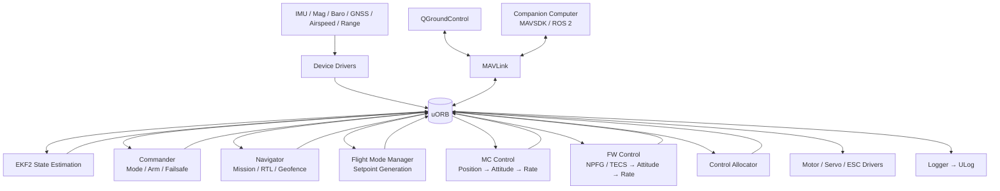
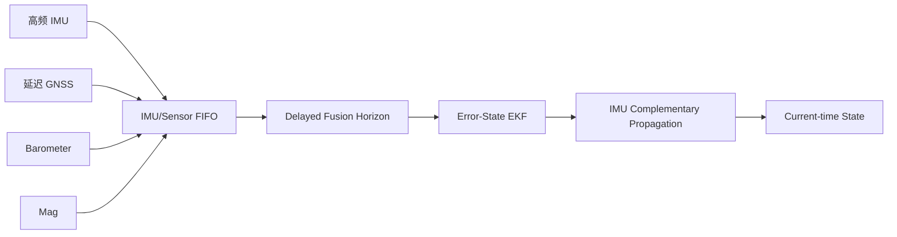
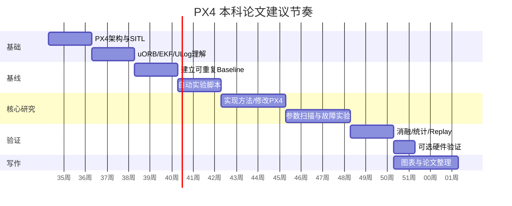

# PX4 本科毕业论文准备：从体系结构、SITL/Gazebo 到真实硬件与选题设计

## 执行摘要

PX4 不是“一个无人机 PID 程序”，而是一套面向无人机与无人系统的、模块化的开源自动驾驶软件平台。它把**传感器驱动、状态估计、飞行模式、任务导航、控制器、执行器分配、MAVLink/ROS 2 通信、日志与仿真**组织在同一个代码库中，各模块主要通过异步发布/订阅总线 **uORB** 交换数据。PX4 官方将整体划分为两层：负责估计、导航与控制的 **Flight Stack**，以及负责驱动、内部/外部通信和仿真的 **Middleware**。citeturn17view3turn18view1

截至 **2026 年 8 月 17 日**，PX4 文档的版本选择器把 **v1.17 标为 stable、v1.18 标为 beta、main 标为 alpha**。因此，对于本科论文，最重要的工程原则之一是：**不要让实验环境随着 `main` 滚动更新**。建议论文开始时冻结到一个明确的稳定 tag/commit，例如以 v1.17 系列作为基线，并在论文中记录 Git commit、Ubuntu 版本、Gazebo 版本、参数文件和仿真模型版本。这样实验才能复现。citeturn17view3turn11search1

PX4 的学习难点主要不在 C++ 语法，而在于理解数据流：

> **传感器 → 驱动 → uORB → EKF2 → vehicle state → 模式/导航产生 setpoint → 位置/姿态/角速度控制器 → thrust/torque → Control Allocation → 电机/舵机。**

`commander` 在这个链路之上管理解锁、模式和 failsafe；`navigator` 管理 mission、RTL、起飞等自主导航逻辑；`mavlink` 把 QGroundControl、伴随计算机等外部系统与 uORB 世界连接起来；`logger` 则从 uORB 侧录制 ULog。citeturn17view3turn20view0turn19search1turn19search2

PX4 的实时行为也值得本科论文认真理解。官方架构文档指出，多数 IMU 驱动可在约 **1 kHz** 采样，并积分后以约 **250 Hz** 发布，而 `navigator` 等高层模块运行频率低得多；整体不是“所有模块固定一个主循环”，而是大量采用**消息更新触发、work queue 或模块自身周期**。因此研究 PX4 时，比“这个函数每秒执行几次”更重要的问题是：**数据时间戳是什么、谁触发谁、端到端延迟是多少、是否丢样、是否产生调度抖动**。citeturn17view3turn19search3

对于仿真，2026 年的新项目应优先考虑现代 **Gazebo**；**Gazebo Classic 已于 2025 年 1 月 29 日结束生命周期**。不过 PX4 当前仍保留 Classic，明确用于 Ubuntu 22.04 上少数尚有需要的场景，因此它仍然适合作为阅读旧教程、复现实验和 UUV 工作的兼容环境。citeturn13search2turn22search2

BlueROV2 是一个需要特别谨慎的方向：PX4 对 **BlueROV2 Heavy 八推进器配置**提供的是**实验性支持**，而当前官方 Gazebo Classic 车辆列表中的 UUV 仿真目标是 **HippoCampus**，不是 BlueROV2。因此，不能把

```bash
make px4_sitl gazebo-classic_uuv_hippocampus
```

称为“BlueROV2 仿真”。更准确的做法是：先用 HippoCampus 验证 PX4 UUV 控制链，再自行构建或移植 BlueROV2 的八推进器模型、推进器布局和水动力模型。这本身就是一个很合适、但风险偏高的本科论文课题。citeturn17view2turn13search6turn22search5

对于嵌入式经验有限的本科生，我最推荐的研究路线是：

**SITL → 学会 uORB/ULog → 做可重复的软件实验 → 修改一个小模块 → 自动化测试 → 最后才接真实 Pixhawk。**

不建议一开始就“买飞控、接电机、改控制器、实飞”。PX4 官方贡献规范本身也强调：新功能应尽可能提供单元/集成测试；硬件相关修改则需要 bench test 或 flight log 证据。citeturn18view3

从“可行性 × 学术性 × 对硬件依赖”的综合角度，本科论文优先推荐：**EKF2 延迟/传感器故障鲁棒性、SITL failsafe 自动化测试、ULog 状态异常分析、ROS 2 Offboard 延迟研究**。如果实验室特别希望做水下机器人，则可选择 **BlueROV2-like PX4 仿真模型与控制分配**。近年来的研究已经证明，PX4 仍是传感器鲁棒性、安全控制、神经网络控制与自主系统实验的重要研究平台。citeturn16search4turn16academia32turn16academia34turn16search5

## PX4 项目概览、代码库与开发方式

**历史与项目定位。** PX4 起源于 ETH Zurich 的无人机/机器人研究工作，Lorenz Meier 是项目的核心创建者；PX4 软件在 2011 年前后以开源项目形式发布并逐渐形成围绕 Pixhawk/PX4 的开放生态。2015 年 Meier、Honegger 与 Pollefeys 的论文 *PX4: A Node-Based Multithreaded Open Source Robotics Framework for Deeply Embedded Platforms* 系统总结了其面向嵌入式机器人系统的模块化、多线程设计，这篇论文至今仍然是理解 PX4 软件思想最重要的学术入口之一。citeturn3search6turn3search12turn16search0

当前 PX4-Autopilot 由 Dronecode Foundation 托管，而 Dronecode 是 Linux Foundation 的协作项目。官方强调 vendor-neutral governance，即不由单一飞控厂商控制路线图。源码采用 **BSD 3-Clause** 许可证，因此允许商业和研究项目修改、再发布，同时需遵守许可证中的版权和免责声明要求。PX4 相关不同资产的许可证不完全相同，例如 Pixhawk 硬件设计和文档存在各自许可证，因此论文若修改硬件文件或复制文档图，应分别核对。citeturn18view1turn18view2turn4view2

社区主要围绕 GitHub Issues/PR、PX4 Discuss、Dronecode Discord 和开放的 Weekly Dev Call 运作。对于论文研究，这一点非常重要：当某个行为与文档不一致时，应先搜索对应版本的 GitHub issue/PR 和模块源码，而不是仅根据博客或旧教程判断。citeturn18view1

**建议使用的版本策略：**

```text
论文实验代码
    ↓
固定 PX4 tag / commit
    ↓
固定 submodule revisions
    ↓
固定 Ubuntu / simulator
    ↓
保存 parameters + airframe + world/model
    ↓
保存 ULog + scripts + experiment metadata
```

截至本文日期，官方文档导航显示 v1.17 stable、v1.18 beta、main alpha，因此本科论文通常应以 stable 为主，只在研究某个刚加入的新功能时才使用 `main`，并明确记录 commit hash。citeturn17view3

**PX4-Autopilot 代码库地图。** 当前主仓库顶层包含 `ROMFS`、`Tools`、`boards`、`msg`、`platforms`、`src`、`test` 以及 CMake/Kconfig 等构建文件。citeturn18view0

| 路径/文件 | 本科生应该怎样理解 | 常见研究用途 |
|---|---|---|
| `src/modules/` | 核心运行模块所在区域，包含 EKF2、Commander、Navigator、MAVLink、MC/FW 控制等 | 改算法最常进入 |
| `src/drivers/` | IMU、磁罗盘、气压计、GNSS、CAN 等硬件驱动 | 传感器/硬件接口课题 |
| `src/lib/` | 控制、数学、估计等可复用库 | 算法阅读和单元测试 |
| `msg/` | uORB `.msg` 定义，由构建系统生成 C/C++ 数据类型 | 增加模块接口、理解数据流 |
| `srv/` | 服务/版本化接口相关定义 | ROS 2 / 新接口研究 |
| `boards/` | 各飞控板的板级 Kconfig/硬件构建配置 | 自定义固件、板级移植 |
| `platforms/` | NuttX/POSIX 等平台抽象 | 嵌入式/OS 方向 |
| `ROMFS/` | PX4 启动文件系统和初始化配置脚本 | 研究启动、airframe 初始化 |
| `Tools/` | 安装、仿真、CI、上传、分析等开发脚本 | 日常工程工具 |
| `test/` | 集成测试等测试基础设施 | 自动化测试论文 |
| `.github/` | CI/workflow | 学习官方验证流程 |
| `.vscode/` | PX4 官方 VSCode 工作区配置 | 新手开发 |
| `CMakeLists.txt` / `Makefile` | 构建入口 | 添加模块 |
| `Kconfig` | 功能/模块裁剪配置 | 自定义固件 |

该结构来自当前 PX4-Autopilot 仓库；具体模块位置可以通过官方自动生成的 Modules & Commands Reference 与源码交叉确认。citeturn18view0turn15search5

特别要掌握的是 `msg/`。uORB 消息由 `.msg` 定义，构建时生成对应 C/C++ 类型；所有消息都应有 `timestamp`，以支持日志记录和正确的时间语义。默认 uORB topic 只需要保留最新值，因此缓冲区通常很短；对于 `vehicle_command` 一类不能轻易丢失的事件消息，才需要关注队列长度。这解释了为什么不能把 uORB 简单理解为传统 FIFO 消息队列。citeturn19search3

**推荐的源码阅读次序不是从 `main()` 开始。** 更有效的是：

```text
msg/*.msg
   ↓
模块 Reference
   ↓
模块 *.hpp / *.cpp
   ↓
Subscription / Publication
   ↓
参数定义
   ↓
调用的 lib
   ↓
启动脚本 / airframe
```

例如读多旋翼位置控制器时，先看官方 `mc_pos_control` 描述和输入输出，再进入 `src/modules/mc_pos_control/`，会比直接在数万文件里搜索 PID 更高效。官方说明当前 `mc_pos_control` 包含位置 P 环和速度 PID 环，并把速度控制结果转换为 thrust vector。citeturn19search1

**开发工作流。** PX4 官方采用 GitHub Flow：fork → 从 `main` 建 feature branch → 修改 → format/static checks/test → commit → PR。当前 CONTRIBUTING 要求 C/C++ 经 astyle 检查，并有 clang-tidy；Python 使用 mypy/flake8；提交标题采用 Conventional Commits，例如：

```bash
git checkout -b thesis-ekf-delay

# 修改、构建、测试
make check_format
make tests

git add .
git commit -m "test(ekf2): add delayed GPS regression case"
```

新功能应尽可能添加 unit/integration test；硬件相关改动若无法在 SITL 自动测试，应提供 bench/flight evidence。citeturn17view1turn18view3

本科论文即使不打算向 PX4 upstream 提 PR，也非常值得遵循这一流程，因为它天然形成：

```text
论文假设
→ 独立 Git branch
→ 可审核代码
→ 自动测试
→ ULog 实验数据
→ Git commit 对应实验结果
```

这比“最终论文附件里放一个改过的源码压缩包”具有高得多的可复现性。

## 架构、关键模块与数据流

PX4 最核心的架构思想可以用下面这张图概括。官方架构明确把系统拆成 Flight Stack 与 Middleware，并以 uORB 作为绝大多数模块之间的异步通信机制。citeturn17view3turn15search8



### 核心中间件：uORB

uORB 是 PX4 内部的异步 publish/subscribe API，用于线程间和进程间通信。发布者不需要知道订阅者是谁，订阅者也不需要直接调用控制器或驱动。这种解耦是 PX4 能让同一套控制/估计算法同时运行于 NuttX 飞控和桌面 SITL 的关键因素之一。citeturn19search3turn17view3

例如：

```text
IMU driver
    │
    ├─ sensor_gyro
    ├─ sensor_accel
    ↓
   uORB
    ↓
 sensor processing / EKF2
    ↓
 vehicle_attitude
 vehicle_local_position
    ↓
 controller
```

调试时最重要的两个命令是：

```bash
uorb top
listener vehicle_attitude 5
```

`uorb top` 可以观察 topic 的发布速率，`listener` 可以直接检查消息内容。官方还提供根据源码生成的 uORB Publication/Subscription Graph，非常适合毕业论文画依赖关系图时用于验证自己的理解。citeturn19search2turn19search3turn15search8

### 驱动与时间链路

传感器驱动将 SPI/I²C/UART/CAN 等底层硬件输入转换为标准 uORB topic。PX4 官方架构文档指出，许多 IMU 驱动以约 1 kHz 采样、积分并约 250 Hz 发布，而 Navigator 等高层逻辑运行明显更慢。这里最重要的结论不是死记 1000/250，而是理解**不同层级拥有不同时间尺度**。citeturn17view3

典型控制系统因此呈现：

```text
快
IMU sampling
    ↓
angular-rate control
    ↓
attitude control
    ↓
velocity / position control
    ↓
mission / navigation
慢
```

任何本科论文若研究延迟、滤波、网络控制或传感器融合，都应尽量测量：

\[
t_{\text{sensor}}
\rightarrow
t_{\text{publish}}
\rightarrow
t_{\text{estimator}}
\rightarrow
t_{\text{controller}}
\rightarrow
t_{\text{actuator}}
\]

而不是只测程序总体 CPU 时间。PX4 的消息时间戳和 ULog 非常适合做这种分析。citeturn19search3turn14search12

### EKF2：状态估计的中心

EKF2 是 PX4 的主要导航状态估计器之一，用 IMU 进行预测，并融合 GNSS、磁场、气压高度等观测。官方文档列出的状态包括姿态四元数、三维速度/位置、陀螺和加速度计 bias、地磁场、磁传感器 bias、风速和地形高度等。citeturn14search2turn20view2

一个本科论文非常值得理解的设计是 **delayed fusion horizon**：



由于不同传感器存在不同延迟，EKF 不简单地“收到一条 GPS 就与当前状态直接融合”，而是维护一个延迟融合时间点，从各 sensor FIFO 取得对应时刻的数据，再利用缓冲的 IMU 将结果传播至当前时间。`EKF2_*_DELAY` 和 `EKF2_DELAY_MAX` 与这一机制直接相关。citeturn20view2turn20view3

这也是为什么 **“GNSS 延迟对 EKF2 的影响”** 是特别适合本科毕业论文的课题：问题有清晰理论基础，又能纯 SITL 完成。

### Commander：系统状态、模式和安全监督

`commander` 包含模式切换与 failsafe 的状态机，是“系统能不能进入某个状态”的主要守门人。它处理 arming/preflight、模式变化、takeoff/land 等系统行为。citeturn20view0

所以这两个概念必须区分：

```text
Navigator / controller:
“应该往哪里飞、怎样产生控制量？”

Commander:
“现在允许飞吗？处于什么模式？发生故障该进入什么系统状态？”
```

当 SITL 出现：

```text
not ready to arm
preflight check failed
mode cannot be entered
```

新手最糟糕的做法是立即：

```bash
commander arm -f
```

虽然 CLI 有强制解锁选项，但它的含义正是跳过正常 preflight 检查；在真实硬件尤其不应把它当故障解决方案。应先执行/阅读 preflight 状态并找出根因。citeturn20view0turn14search8

### Navigator 与 setpoint 生成

`navigator` 负责高层自主模式，例如 mission、takeoff、RTL 和 geofence。当前 PX4 还存在 `flight_mode_manager`、`fw_mode_manager` 等模块，将当前 mode 状态进一步变换成控制器真正消费的 setpoint。citeturn19search1

可以把层次抽象为：

```text
Mission / RTL / user command
          ↓
      Navigator
          ↓
    navigation target
          ↓
Flight/FW Mode Manager
          ↓
position / velocity / attitude setpoint
          ↓
       Controller
```

因此毕业论文如果只是想实现一个“无人机按照新的轨迹走”的算法，不一定需要直接改 attitude/rate controller；很多课题更适合在 setpoint/offboard 层完成。

### 多旋翼控制栈

当前官方模块说明给出的核心关系是：

\[
e_p = p_{sp}-p
\]

位置 P 环产生速度要求；速度 PID 进一步生成 thrust vector；姿态控制器以四元数误差产生 rate setpoint；rate controller 根据角速度误差进行 PID 控制。citeturn19search1turn17view4

可简化为：

```text
position_sp
    ↓
mc_pos_control
Position P
    ↓
velocity_sp
    ↓
Velocity PID
    ↓
thrust vector
    ↓
attitude_sp + thrust_sp
    ↓
mc_att_control
Quaternion attitude P
    ↓
rate_sp
    ↓
mc_rate_control
Rate PID
    ↓
torque_sp + thrust_sp
    ↓
control_allocator
    ↓
individual motors
```

PX4 的多旋翼姿态控制基于四元数方法；官方模块说明直接引用了 Brescianini、Hehn 与 D'Andrea 的 *Nonlinear Quadrocopter Attitude Control*，这篇论文值得作为控制方向本科生的理论阅读材料。citeturn19search1

### 固定翼控制栈

固定翼与多旋翼最大的区别不是“PID 参数不同”，而是其物理问题明显更受空气动力学约束。PX4 当前固定翼高层水平导航使用 NPFG，纵向高度/空速控制使用 TECS；TECS 同时考虑高度和 true airspeed，并产生 throttle 与 pitch setpoint。citeturn15search6turn17view4

TECS 的思想可以从能量角度理解：

\[
E = E_p + E_k
= mgh + \frac{1}{2}mv^2
\]

油门主要改变总能量，而俯仰则在势能与动能之间重新分配。因此：

```text
Altitude setpoint ─┐
                   ├─ TECS → throttle_sp
Airspeed setpoint ─┘        → pitch_sp
                               ↓
                          FW attitude
                               ↓
                           FW rate
                               ↓
                     aileron/elevator/rudder
```

官方同时强调，应先调好 attitude controller，再调 TECS，否则表现为“TECS 高度/速度跟踪差”的问题可能其实来自 pitch loop。citeturn17view4turn15search6

### Control Allocation

控制器输出的通常不是“电机 1 = 40%，电机 2 = 52%”，而是更抽象的力/力矩需求。`control_allocator` 接收 thrust 与 torque setpoint，再根据飞行器几何和执行器能力产生 actuator setpoint。citeturn19search1

这使 PX4 可以把：

```text
Controller
  ↓
Desired Fx,Fy,Fz,Mx,My,Mz
  ↓
Control Allocation
  ↓
Motor/Servo commands
```

与具体机架布局分离，也解释了为什么 VTOL、八旋翼、BlueROV2 等非普通 Quad-X 平台特别依赖正确的 actuator geometry。

### MAVLink：PX4 与外界的桥

PX4 的 `mavlink` 模块支持串口或 UDP，可同时运行多个独立实例。某些 MAVLink 协议由模块直接处理，其他消息会转成 uORB，例如外部 command 可进入 `vehicle_command`。发送端和接收端是两个线程；发送 stream 具有各自速率，并会在链路带宽不足时动态降低 rate，`mavlink status` 中可以观察相应状态。citeturn19search2

因此 MAVLink 的合理抽象是：

```text
QGroundControl
MAVSDK
Companion Computer
      ↕
    MAVLink
      ↕
PX4 mavlink module
      ↕
     uORB
      ↕
Commander / Navigator / sensors / status
```

它不是 PX4 内部所有模块相互通信的总线；**内部核心是 uORB，MAVLink 是外部通信协议之一。**

## 支持平台、飞控、传感器与伴随计算机

PX4 的主流目标包括 multirotor、fixed-wing、VTOL 和 rover，并对 helicopter、airship、submarine 等提供程度不同的支持；官方特别指出部分实验性平台并不处于常规 flight-test program。citeturn18view1

| 平台 | 主要执行器 | 最关键状态/传感器 | PX4 控制重点 | SITL/论文难度 |
|---|---|---|---|---|
| 多旋翼 MC | 多个独立旋翼 | IMU、baro、mag；自主飞行通常加 GNSS；室内可 optical flow/VIO | 位置→速度→姿态→角速度级联 | **低，最适合入门** citeturn19search1turn22search1 |
| Fixed-Wing | 推进器+副翼/升降舵/方向舵 | IMU、GNSS、baro、**airspeed** | NPFG、TECS、姿态/角速度 | 中等，需理解空气动力学 citeturn15search6turn22search7 |
| VTOL | MC 推进系统 + FW 执行器 | MC+FW 传感器组合，airspeed 很重要 | 两种控制栈+transition+allocation | 高 citeturn17view4turn22search1 |
| BlueROV2 Heavy | 8 个矢量推进器 | IMU/heading/深度与外部定位视配置而定 | 6-DOF 水下运动、allocation | **较高且 experimental** citeturn17view2turn13search6 |

BlueROV2 Heavy 的 PX4 页面定义的是八推进器矢量布局，并按 surge、sway、heave、yaw 等水下 body-axis 运动来组织控制。当前 UUV 文档明确称该支持为 experimental，并列出 Manual、Stabilized、Acro、Altitude 和 Position 等基本模式，同时提醒水下 autonomous mission workflow 相比航空平台仍有限。citeturn17view2turn13search6

**常见飞控。** 当前选择飞控时，建议优先查看 PX4 的 Project/Manufacturer-supported 分类，而不要机械照抄几年以前的“Pixhawk 推荐榜”。当前文档中仍有多种 H7/Pixhawk v6 级产品与 ARK/CUAV 等板卡；同时一些过去非常常见的控制器已经被移动到 discontinued 页面，例如 CUAV X7 等旧型号。citeturn22search0turn22search3

本科项目的实际选择可以这样理解：

| 类型 | 示例 | 适合情况 | 建议 |
|---|---|---|---|
| Pixhawk v6 级 | Pixhawk 6C、6X 等 | 通用 MC/FW/VTOL | 新购硬件优先考虑 |
| 厂商维护 H7 | ARKV6X、CUAV Nora/V6 系列等 | 工业/研究机体 | 核实当前 PX4 版本支持 |
| 旧 Pixhawk/Cube/X7 类 | 实验室可能已有 | 继承老平台 | 先检查当前 release 是否仍发布 firmware |
| Linux 飞控类 | RPi + PilotPi 等 | Linux/研究型开发 | 嵌入式实时行为与 Pixhawk/NuttX 不完全相同 |

例如 CUAV Nora 当前文档列出 STM32H743 和多套 IMU、磁传感器与双 barometer，是现代 H7 飞控冗余传感器设计的典型例子。citeturn22search6

**传感器比较。** PX4 官方给出的最小基础传感器集合包括 gyro、accelerometer、magnetometer 和 barometer；FW/VTOL 强烈建议增加 airspeed；需要完整自动模式时则一般需要 GNSS 或另一种位置源。citeturn22search1

| 传感器 | 测量/提供的信息 | 对哪些平台关键 | 常见论文问题 |
|---|---|---|---|
| Gyroscope | 角速度 | 全部 | bias、振动、故障、滤波 |
| Accelerometer | 比力/运动信息 | 全部 | bias、振动、EKF |
| Magnetometer | heading 辅助 | 多数平台 | 电磁干扰、heading failure |
| Barometer | 气压高度 | 航空器 | 气流扰动、高度融合 |
| GNSS/RTK | 全球位置/速度 | 自动航迹、任务 | delay、dropout、spoofing、融合 |
| Airspeed/Pitot | 相对空气速度 | **FW/VTOL 特别重要** | TECS、stall、传感器故障 |
| Rangefinder | 对地距离/障碍距离 | 低空/室内 | landing、terrain |
| Optical Flow | 相对地面运动 | GNSS-denied MC | 室内 position hold |
| Camera/VIO | 外部视觉位姿 | 自主/室内 | latency、drift、ROS 2 |

PX4 特别强调 FW/VTOL 的 airspeed，因为产生升力的是相对空气速度而不是地速；optical-flow 则通常结合朝下摄像头与距离传感器，在室内等 GNSS-denied 环境提供速度信息。citeturn22search7turn22search4

**伴随计算机。** 飞控 MCU 适合硬实时的估计、控制和安全状态机，而 Jetson/Raspberry Pi/NUC 等 companion computer 更适合视觉、SLAM、路径规划、神经网络和 ROS 2。PX4 当前支持通过 MAVLink 或 microROS/uXRCE-DDS，经串口或支持时经 Ethernet 与伴随计算机通信。官方示例包括 Raspberry Pi、NVIDIA Jetson、ModalAI VOXL 2、NXP NavQPlus、Intel NUC 等。citeturn21search1turn21search2

一个很重要的系统工程原则是：

```text
Flight Controller
    EKF
    low-level control
    arming/failsafe
    actuator output
       ↕ MAVLink / DDS
Companion Computer
    perception
    SLAM
    trajectory planning
    AI
    high-level autonomy
```

不要把 Jetson 当成 Pixhawk 的“更快替代品”。真正安全的架构通常仍让低层控制和 failsafe 留在飞控内。

真实接线时还要注意电气层面：PX4 文档特别警告某些 companion UART 使用 1.8 V，而 Pixhawk 端通常是 3.3 V，直接连接可能损伤设备，需要确认电平或使用 level shifter；Raspberry Pi/Jetson 等高功耗 companion 也不应随意从飞控外设电源取电。citeturn21search0turn21search2

## SITL、Gazebo Classic、真实硬件构建与安全路线

**先明确 2026 年的仿真现实。** Gazebo Classic 已于 2025 年 1 月 29 日 EOL；PX4 当前文档表示现代 Gazebo 正逐步达到并替代 Classic 的功能，Classic 主要保留给 Ubuntu 22.04 上仍需要它的少数用例。因此对于新论文：

- 新的 multirotor/ROS 2 项目优先考虑现代 Gazebo。
- 为复现老论文、老 ROS/Gazebo 教程或当前 Classic-only UUV target，可使用 Classic。
- 在论文实验章节明确写“Gazebo Classic 11 / Ubuntu 22.04”，避免只写“Gazebo”。citeturn13search2turn22search2turn13search21

### 建议的环境基线

若论文确实要求 Gazebo Classic，当前 PX4 文档明确针对 **Ubuntu 22.04** 给出安装方式。标准 PX4 Ubuntu setup 会安装 Gazebo Harmonic；如要 Classic，需要删除 Harmonic 并安装 Classic 11 依赖。citeturn22search2

首先克隆源码并固定版本：

```bash
git clone https://github.com/PX4/PX4-Autopilot.git --recursive
cd PX4-Autopilot

# 本科论文不要长期追 main。
# 以下只是一个可复现实验基线示例：
git checkout v1.17.0
git submodule update --init --recursive

bash ./Tools/setup/ubuntu.sh
```

官方 Ubuntu 环境脚本支持当前 Ubuntu LTS 开发环境，并安装 NuttX/Pixhawk 构建工具和仿真依赖；使用旧 release 时，应以该 release 对应文档为最终准则。citeturn14search18

若目标就是 Gazebo Classic，在 Ubuntu 22.04 按当前官方 Classic 文档：

```bash
sudo apt remove gz-harmonic
sudo apt install aptitude
sudo aptitude install gazebo libgazebo11 libgazebo-dev
```

PX4 特意使用 `aptitude`，是因为 Classic 与新 Gazebo 依赖间可能存在普通 `apt` 无法方便解决的冲突。citeturn22search2

### 多旋翼 Classic SITL

进入仓库根目录：

```bash
make px4_sitl gazebo-classic
```

官方还提供：

```bash
# optical flow
make px4_sitl gazebo-classic_iris_opt_flow

# forward depth camera
make px4_sitl gazebo-classic_iris_depth_camera

# fixed wing
make px4_sitl gazebo-classic_plane

# standard VTOL
make px4_sitl gazebo-classic_standard_vtol
```

完整 target 可通过：

```bash
make px4_sitl list_vmd_make_targets
```

再查找以 `gazebo-classic_` 开头的目标。citeturn22search2turn22search5

启动后，建议第一天完全不改代码，只在 PX4 shell 中观察：

```bash
uorb top
listener vehicle_attitude 5
listener vehicle_local_position 5
ekf2 status
mavlink status
commander check
```

然后通过 QGroundControl 做 takeoff/land，观察：

```text
setpoint
estimate
controller output
actual simulated motion
```

之间的关系。`uorb top`、`mavlink status` 和 Commander CLI 都有官方模块级支持。citeturn19search2turn20view0

也可以测试：

```bash
commander takeoff
commander land
```

但如果出现 preflight failure，应处理故障原因，而不是为了“让仿真飞起来”直接使用强制 arm。citeturn20view0

### BlueROV2 / UUV 仿真：必须区分“官方 UUV target”和“BlueROV2”

当前官方 Gazebo Classic target 是：

```bash
make px4_sitl gazebo-classic_uuv_hippocampus
```

这启动的是 **HippoCampus TUHH UUV**。当前官方车辆列表没有提供等价的 `gazebo-classic_bluerov2` target。与此同时，PX4 对真实 BlueROV2 Heavy 的文档描述的是 experimental 八推进器配置。citeturn22search5turn17view2

所以一个严谨的 BlueROV2 模拟工作流应该是：

```text
HippoCampus target
      ↓
先确认 PX4 UUV controller 能运行
      ↓
理解 UUV uORB / thrust / torque
      ↓
建立 BlueROV2 Heavy 8-thruster SDF/model
      ↓
建立推进器位置与方向
      ↓
对应 PX4 actuator/control allocation
      ↓
加入水动力 / buoyancy / drag
      ↓
验证 surge/sway/heave/yaw
      ↓
和实机参数或文献数据校准
```

当前 `uuv_att_control` 文档给出了固定 250 Hz 的 thrust/torque setpoint 发布行为；真实 BlueROV2 页面则给出了八推进器 motor mapping，因此两者结合起来就构成了一个很清晰的论文切入点。citeturn19search1turn17view2

这里最大的研究风险不是 PX4 编译，而是**水动力模型真实性**。如果只是把八个电机放进 Gazebo，却没有合理建模浮力、阻力、附加质量和推进器响应，那么轨迹看起来能跑，但控制性能结论可能没有物理意义。

### SITL 常见坑

| 现象 | 常见原因 | 优先处理 |
|---|---|---|
| CMake/build 莫名失败 | submodule 与 checkout 不匹配 | `git submodule update --recursive` |
| 切 branch 后出现奇怪编译错误 | build cache 混合 | `make distclean` |
| Classic 包依赖冲突 | Harmonic/Classic 共存 | 按官方 Classic 安装流程使用 `aptitude` |
| target 找不到 | 当前 branch 没有对应 model | `make px4_sitl list_vmd_make_targets` |
| QGC 不连接 | UDP/firewall/VM/WSL 网络问题 | 检查 `mavlink status` 和 UDP 配置 |
| 无法 arm | preflight/position/GCS/mode 要求未满足 | `commander check`，读错误信息 |
| 仿真表现突然变化 | 代码/参数/模型版本漂移 | 固定 tag、参数和 model commit |

PX4 构建文档明确指出，submodule 不匹配和未清理的 build environment 是常见构建失败来源，并建议更新 submodule 后执行 `make distclean`。citeturn17view5

### 从仿真走向真实飞控

对于嵌入式经验有限的学生，推荐按照以下“验证阶梯”前进：


真实飞控构建首先确认目标：

```bash
make list_config_targets
```

然后根据**具体板卡文档**选择 target。例如某 v6X 类飞控可能使用：

```bash
make px4_fmu-v6x_default
```

通过 USB 上传的一般形式为：

```bash
make <board_target> upload
```

官方构建文档给出的示例是：

```bash
make px4_fmu-v4_default upload
```

因此不要仅凭“它长得像 Pixhawk”猜 target，应查具体 flight-controller 页面。citeturn17view5

对初学者，更稳妥的第一步通常是先通过 QGroundControl 安装稳定官方 firmware，完成标准配置并确认整机工作，再尝试自己编译同版本源码并上传。这样当硬件不工作时，可以区分是**接线/配置问题**还是**自定义源码问题**。

### 第一次真实硬件配置顺序

建议遵守：

```text
确定板卡/固件
    ↓
只 USB，不接螺旋桨
    ↓
QGC 识别飞控
    ↓
Airframe
    ↓
Sensor calibration
    ↓
Actuator geometry/output mapping
    ↓
RC / joystick / telemetry
    ↓
Battery/power configuration
    ↓
Failsafe
    ↓
无桨 actuator test
    ↓
查看日志
    ↓
最后才安装螺旋桨
```

**最重要的安全规则：测试执行器和映射时拆掉螺旋桨。** PX4 的 Actuator Configuration 文档明确反复要求在 output assignment 或 actuator test 前拆除 propellers。citeturn14search5

同时需要测试至少这些 failsafe：

```text
RC / command loss
GCS / offboard loss
low battery
position estimate failure
geofence（如使用）
```

PX4 提供独立的 safety/failsafe 配置体系，并允许在 QGC 中设置低电量警告与动作。citeturn14search1turn14search17

真实机上也不要为了绕过一个红色错误而使用强制 arm。正常 pre-arm checks 会阻止未校准、传感器异常或当前 mode 缺少有效 position estimate 的机体解锁，这是安全设计而不是“麻烦的限制”。citeturn14search8

## 开发、调试、日志分析与本科论文选题

PX4 最有效的开发方式是“观察数据 → 建立假设 → 重现实验 → 改代码 → 自动回归”，而不是不断在 QGC 中调参数直到“感觉飞得好”。

**第一组工具：PX4 shell。**

```bash
# topic 速率
uorb top

# topic 数值
listener sensor_gyro 5
listener vehicle_attitude 5
listener vehicle_local_position 5

# estimator
ekf2 status

# communication
mavlink status

# vehicle state/preflight
commander check

# 模块运行情况
top
```

官方架构指出，NuttX 上可以用 `top` 查看当前运行模块；uORB 和 MAVLink 各自提供实时状态命令。citeturn17view3turn19search2

**第二组工具：ULog。** PX4 `logger` 将可配置 uORB topics 以及 WARN/ERR 等记录为 ULog，可用于性能评估、tuning、replay 和 crash analysis；ULog 是自描述格式，包含消息格式信息。citeturn19search0turn14search12

典型研究流程：

```text
实验
 ↓
.ulg
 ↓
Flight Review / Foxglove / pyulog
 ↓
Python dataframe
 ↓
时间对齐
 ↓
RMSE / latency / innovation / saturation
 ↓
统计检验与图表
```

官方 Flight Log Analysis 页面列出 Flight Review、Foxglove 等工具，`pyulog` 则适合程序化处理大量实验。citeturn13search7turn14search6

例如论文中不要只说：

> “修改后飞行更稳定。”

更好的评价是：

\[
RMSE_p =
\sqrt{\frac{1}{N}
\sum_{k=1}^N
\|p_k-p_{sp,k}\|^2}
\]

再配合：

- position RMSE；
- attitude/rate tracking error；
- overshoot；
- settling time；
- actuator saturation ratio；
- estimator innovation；
- CPU load；
- message latency；
- failsafe detection time。

这样论文才从“工程 demo”变成可验证实验。

**Replay。** PX4 支持 system-wide replay，可以基于已记录的 uORB 数据重新运行部分系统，用相同飞行数据比较参数或 estimator。对于 EKF2 论文尤其有价值，因为可以控制输入数据不变，只改变算法/参数。citeturn13search10turn19search0

**GDB/SITL。** 官方提供 SITL GDB 调试方法，例如：

```bash
make px4_sitl_default gazebo-classic
```

启动后可附加到 PX4 进程，也可通过 VSCode 的 PX4 workspace 使用 SITL debug target、断点和单步执行。citeturn13search4turn13search16

**测试。** PX4 当前 unit-test 文档给出的入口是：

```bash
make tests
```

而 MAVSDK-based integration test 用于 SITL 端到端行为，官方称其为推荐的 PX4 integration-test framework；Contribution Guide 也将 `make tests`、MAVSDK SITL 和 bench/flight log 列为主要验证层次。citeturn13search1turn13search25turn18view3

因此一个成熟的毕业论文代码仓库最好至少包含：

```text
thesis/
├── px4_patch/
├── experiments/
│   ├── normal/
│   ├── gps_delay/
│   └── gps_dropout/
├── scripts/
│   ├── run_experiment.py
│   └── analyze_ulog.py
├── params/
├── logs/
├── figures/
└── README_reproduction.md
```

### 本科论文项目比较

下面给出的时间以约 **12–16 周有效项目周期**估算，不包含正式论文排版和学校行政时间。难度判断是基于 PX4 当前接口、仿真和相关研究方向做出的实践性评估。citeturn16academia32turn16academia34turn16search5turn16search17

| 题目 | 工作范围 | 技能 | 建议周期 | 主要风险 | 交付物 | 推荐度 |
|---|---|---|---|---|---|---|
| **EKF2 传感器延迟与 dropout 鲁棒性** | 对 GNSS/baro/mag 注入延迟、丢失、noise，分析 EKF innovation 与轨迹误差 | Python、C++基础、Kalman filter | 12–14 周 | EKF 参数很多，实验设计需控制变量 | 自动实验脚本、ULog 数据集、统计结果、可选 EKF 改进 | ★★★★★ |
| **PX4 Failsafe 自动回归测试框架** | MAVSDK+SITL 自动注入 GPS/RC/battery 等故障并验证状态机 | Python/C++、测试工程、MAVLink | 10–14 周 | 学术“算法创新”较弱，需强调系统验证方法 | test suite、failure matrix、coverage/latency 数据 | ★★★★★ |
| **ULog 飞行健康与异常检测工具** | 自动分析 estimator/controller/sensor 指标，检测异常片段 | Python、信号处理、数据分析 | 10–14 周 | 容易变成纯 UI 项目 | 数据集、检测算法、CLI/dashboard、precision/recall | ★★★★★ |
| **ROS 2 Offboard 网络延迟/丢包研究** | 在 SITL 中控制延迟、jitter、packet loss，测 tracking/failsafe | ROS 2、DDS、Python/C++、控制 | 12–16 周 | ROS 2 环境配置复杂 | 延迟测试平台、性能曲线、设计建议 | ★★★★☆ |
| **BlueROV2-like 八推进器 Gazebo 模型** | 从官方 UUV target 发展八推进器模型和 allocation | Gazebo/SDF、C++、动力学 | 14–16+ 周 | Classic EOL、水动力建模难、PX4 UUV experimental | 模型、airframe/allocation、验证数据、教程 | ★★★★☆ |
| **多旋翼 Control Allocation 执行器故障研究** | 模拟单电机性能下降/故障，比较可控性和重新分配策略 | 线代、控制、C++ | 14–16 周 | 安全/可控性理论要求较高 | allocator patch、fault scenarios、tracking metrics | ★★★★☆ |
| **PX4 嵌入式神经网络控制可行性复现/扩展** | 复现 NN controller，再研究 CPU/latency/robustness | ML、控制、C++、TFLite | 16 周以上 | 训练、部署和验证同时存在风险 | policy、PX4 module、benchmark、SITL/可选硬件结果 | ★★★☆☆ |

**最推荐课题：EKF2 延迟/故障鲁棒性。**

理由是 PX4 EKF2 本身已经明确设计了 delayed fusion horizon 与 sensor FIFO，因此研究问题直接对应真实架构，而不是人为制造一个与 PX4 无关的小算法。citeturn20view2

可以设计实验矩阵：

| 实验 | GNSS delay | GNSS loss | IMU noise | 评价 |
|---|---:|---:|---:|---|
| Baseline | 0 | 0 | nominal | 基准 |
| D1 | 50 ms | 0 | nominal | RMSE |
| D2 | 100 ms | 0 | nominal | RMSE/innovation |
| D3 | 200 ms | 0 | nominal | stability |
| L1 | nominal | 2 s | nominal | recovery |
| L2 | nominal | 10 s | nominal | failsafe |
| N1 | nominal | 0 | increased | estimator health |

最终研究问题可以变成：

> 在不同 GNSS latency 与 dropout 条件下，PX4 EKF2 的 delayed fusion 参数对定位误差、innovation 和恢复时间有何影响？

这已经是一个非常像完整本科论文的问题。

**最推荐的软件工程课题：failsafe 自动测试。** 当前 PX4 社区本身重视 SITL integration tests，而近年的研究也持续使用 PX4 SITL 做 sensor failure injection 与自动测试。citeturn13search25turn16search17

可以实现：

```python
scenario = {
    "flight_mode": "position",
    "fault": "gps_loss",
    "fault_time_s": 20,
    "fault_duration_s": 10,
    "expected_state": "failsafe",
    "max_detection_latency_s": 1.0,
}
```

然后自动：

```text
启动 SITL
→ 起飞
→ 稳定 hover
→ 故障注入
→ 记录 vehicle_status
→ 检查 failsafe
→ 下载 ULog
→ 生成结果 JSON
```

软件量适中、实验高度可重复，而且不需要购买硬件。

**最有 PX4/UUV特色的课题：BlueROV2-like 模型。** 研究重点不要写成“在 Gazebo 里放一个潜艇模型”，而应写成：

> Design and validation of an eight-thruster BlueROV2-compatible simulation and control-allocation model for PX4.

核心贡献包括：

\[
\mathbf{w}
=
\begin{bmatrix}
F_x&F_y&F_z&M_x&M_y&M_z
\end{bmatrix}^{T}
=
B\mathbf{u}
\]

其中 \(B\) 为八推进器 geometry 所形成的 control-effectiveness matrix，\(\mathbf{u}\) 为推进器指令。随后研究 actuator saturation、推进器故障或 hydrodynamic disturbances。真实 BlueROV2 Heavy 的八推进器布局和 PX4 experimental 支持可作为工程依据。citeturn17view2

**神经网络控制属于高风险选题。** 2025 年的 *A Neural Network Mode for PX4 on Embedded Flight Controllers* 已展示在 PX4 内把训练策略转成 TensorFlow Lite、运行于微控制器并替代传统控制 cascade 的路线；当前 PX4 module reference 甚至已有 `mc_nn_control`。这说明方向很前沿，但也意味着本科生若再做“把 NN 加入 PX4”本身可能不足以构成新贡献，更合理的是研究**推理延迟、CPU/flash、domain shift、安全 fallback、传统控制与 NN hybrid**。citeturn16search1turn16search4turn19search1

一个通用的 16 周本科论文节奏可以设计为：



这里最关键的是在项目前半程就建立 **baseline + 自动脚本**。如果第 10 周才第一次保存结构化 ULog，后面的论文分析通常会非常痛苦。

## 学习路径、优先阅读与命令速查

建议把 PX4 学习分成“会运行 → 会看数据 → 会读模块 → 会修改 → 会验证”五层，而不要按官方文档目录从头到尾阅读。

**第一阶段：两到三天，建立系统地图。**

优先读：

1. **PX4 Basic Concepts**：理解 flight controller、GCS、flight mode、failsafe 等基本术语。citeturn14search17  
2. **PX4 Architectural Overview**：这是最重要的一篇官方文档，重点看 Flight Stack、Middleware、uORB 和 update rate。citeturn17view3  
3. **PX4-Autopilot README + repository tree**：知道源码实际在哪里。citeturn18view0turn18view1  
4. **Controller Diagrams**：先看 MC，再看 FW/TECS。citeturn17view4

官方文档同时提供中文内容，例如 UUV 等页面已有中文版本；做开发时建议把中文用于理解概念、英语 stable/main 页面用于核对最新 API、参数名和 CLI。citeturn13search6

**第二阶段：一周，学会观察 PX4。**

必读：

- uORB Messaging；citeturn19search3
- Modules & Commands Reference；citeturn15search5
- EKF2 Navigation Filter；citeturn14search2
- Logging / Flight Log Analysis。citeturn14search6turn13search7

每天至少实际运行：

```bash
uorb top
listener vehicle_attitude 5
listener vehicle_local_position 5
ekf2 status
mavlink status
```

目标不是记住命令，而是看到：

```text
source code variable
↕
uORB topic
↕
ULog signal
↕
QGC / Flight Review plot
```

四者是一套系统。

**第三阶段：一到两周，开始改一个最小模块。**

官方 First Application Tutorial 是非常好的第一步，因为它说明如何建立 PX4 module、CMake 配置和 PX4 logging。citeturn13search19

然后建议依次做：

```text
Hello module
↓
订阅一个 uORB topic
↓
发布一个自定义 topic
↓
增加一个 parameter
↓
记录到 ULog
↓
加 unit test
```

完成这些以后，再开始改 EKF/controller，否则很容易把“不会 PX4 工程结构”误认为“控制算法有问题”。

**第四阶段：进入你论文方向对应的源码。**

控制方向：

```text
mc_pos_control
mc_att_control
mc_rate_control
control_allocator
```

固定翼方向：

```text
fw_mode_manager
fw lateral/longitudinal control
fw_att_control
fw_rate_control
TECS / NPFG
```

估计方向：

```text
drivers/sensors
ekf2
sensor topics
vehicle_* estimates
```

自动驾驶/机器人方向：

```text
navigator
flight_mode_manager
MAVLink
ROS 2 / uXRCE-DDS
```

这些模块的当前输入输出和功能可先从自动生成 Module Reference 查看，再进入源码。citeturn19search1turn19search2

### 学术论文阅读优先级

| 优先级 | 文献 | 为什么读 |
|---|---|---|
| **必读** | Meier, Honegger, Pollefeys, 2015, *PX4: A Node-Based Multithreaded Open Source Robotics Framework for Deeply Embedded Platforms* | 理解 PX4 最初的模块化/嵌入式设计思想 citeturn16search0 |
| **MC控制必读** | Brescianini, Hehn, D'Andrea, 2013, *Nonlinear Quadrocopter Attitude Control* | PX4 `mc_att_control` 官方直接引用的姿态控制理论 citeturn19search1 |
| **状态估计方向** | PX4 EKF2 官方设计/调参文档 | delayed horizon、sensor fusion 与实现直接对应 citeturn20view2 |
| **学习控制方向** | Hegre et al., 2025, *A Neural Network Mode for PX4 on Embedded Flight Controllers* | 展示 NN controller 直接运行于 PX4 MCU 的完整路线 citeturn16search1turn16search4 |
| **安全控制方向** | Misyats et al., 2025, *Embedded Safe Reactive Navigation … using Control Barrier Functions* | 展示安全过滤器直接集成 PX4 的研究方式 citeturn16academia32 |
| **故障/鲁棒方向** | Meng et al., 2025, *MARS: Defending UAVs From Attacks on Inertial Sensors…* | PX4 SITL+真实系统、估计器故障检测和恢复 citeturn16academia34 |
| **仿真验证方向** | 2024 Mixed-Reality Sensor Emulation Framework | 展示 Pixhawk 6C、PX4、Gazebo 与真实传感器实验的组合 citeturn16search5 |
| **大型自主系统方向** | 2026 *aerial-autonomy-stack* | 展示 ROS 2、PX4 与 faster-than-real-time 仿真的研究趋势 citeturn16search16 |

这些近期论文有一个共同模式值得模仿：它们通常不是“完全重写 PX4”，而是**保留成熟低层飞控，在 uORB、估计器、setpoint、ROS/MAVLink 或 controller 的一个明确接口上加入新方法，再通过 SITL 与真实实验逐层验证**。例如 MARS 把新的异常检测/恢复模块嵌入 uORB 环境；CBF 工作则将安全过滤器接入 PX4 控制链。citeturn16search20turn16academia32

### 命令速查表

**源码和版本：**

```bash
git clone https://github.com/PX4/PX4-Autopilot.git --recursive
cd PX4-Autopilot

git status
git log -1
git submodule status

git checkout v1.17.0
git submodule update --init --recursive
```

PX4 官方仓库要求递归取得 submodules；版本固定对于可复现实验尤其重要。citeturn18view1

**构建环境：**

```bash
bash ./Tools/setup/ubuntu.sh
```

citeturn14search18

**Gazebo Classic，Ubuntu 22.04：**

```bash
sudo apt remove gz-harmonic
sudo apt install aptitude
sudo aptitude install gazebo libgazebo11 libgazebo-dev
```

citeturn22search2

**多旋翼：**

```bash
make px4_sitl gazebo-classic
```

**Optical Flow：**

```bash
make px4_sitl gazebo-classic_iris_opt_flow
```

**Fixed Wing：**

```bash
make px4_sitl gazebo-classic_plane
```

**VTOL：**

```bash
make px4_sitl gazebo-classic_standard_vtol
```

**UUV/HippoCampus：**

```bash
make px4_sitl gazebo-classic_uuv_hippocampus
```

以上 target 均列于当前官方 Gazebo Classic vehicle 文档。citeturn22search2turn22search5

**查看可用仿真 target：**

```bash
make px4_sitl list_vmd_make_targets
```

citeturn22search2

**观察 uORB：**

```bash
uorb top
listener sensor_gyro 5
listener vehicle_attitude 5
listener vehicle_local_position 5
```

citeturn19search2turn19search3

**检查核心模块：**

```bash
ekf2 status
navigator status
commander status
commander check
mavlink status
logger status
```

对应模块均有官方 CLI/reference。citeturn19search0turn19search1turn19search2turn20view0

**简单 SITL 飞行动作：**

```bash
commander takeoff
commander land
```

citeturn20view0

**单元测试：**

```bash
make tests
```

citeturn13search1turn18view3

**代码格式检查：**

```bash
make check_format
```

必要时：

```bash
make format
```

citeturn17view1

**清理常见 build/submodule 问题：**

```bash
git submodule update --recursive
make distclean
```

citeturn17view5

**查看真实硬件 build target：**

```bash
make list_config_targets
```

citeturn17view5

**编译/上传飞控，具体 target 以板卡文档为准：**

```bash
make <board_target>
make <board_target> upload
```

citeturn17view5

**论文实验最值得养成的最终工作流：**

```text
固定 PX4 commit
      ↓
固定 parameters / airframe
      ↓
自动启动 SITL
      ↓
自动执行轨迹
      ↓
自动注入 disturbance / fault
      ↓
保存 ULog
      ↓
Python 自动提取相同指标
      ↓
多次重复实验
      ↓
统计比较
      ↓
Git commit + 配置 + log 可追溯
```

从本科论文的投入产出比来看，**“能稳定、自动地重复 50 次实验”通常比“能手动演示一次很复杂的飞行”更有学术价值**。PX4 已经提供 SITL、uORB、ULog、Replay、MAVSDK integration testing 与完整源码基础设施，因此最值得利用的并不是它“能让无人机飞”，而是它已经把**控制、估计、通信、故障、安全与仿真**组织成了一个可以做系统性实验的平台。citeturn13search10turn13search25turn18view3